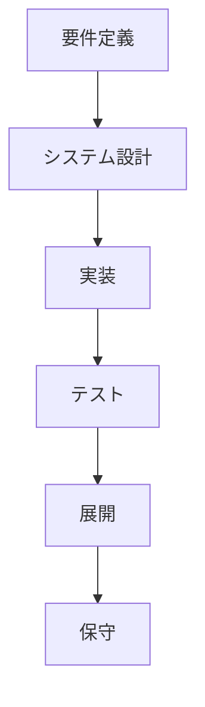
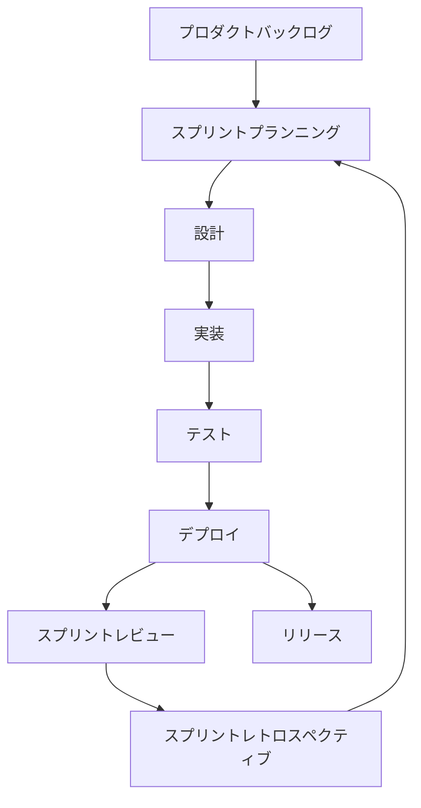
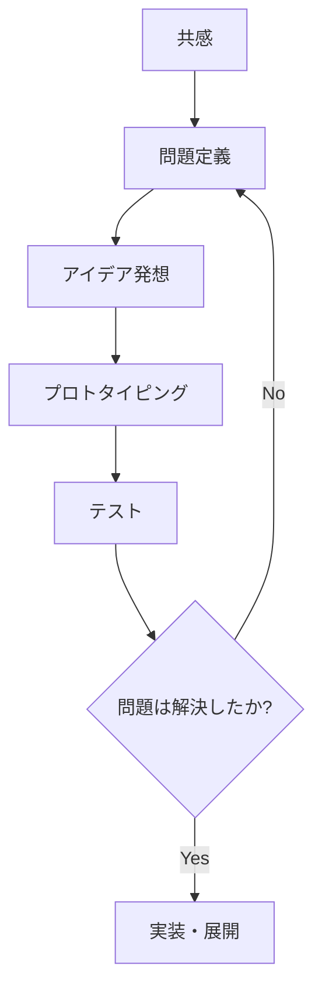
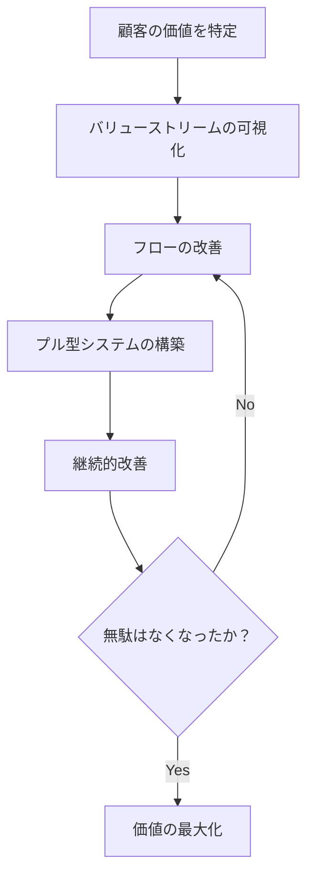
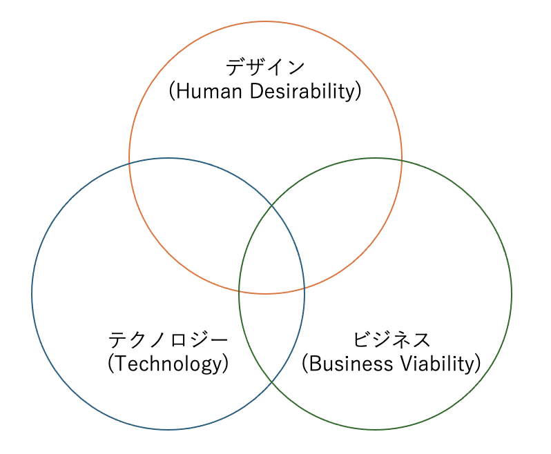
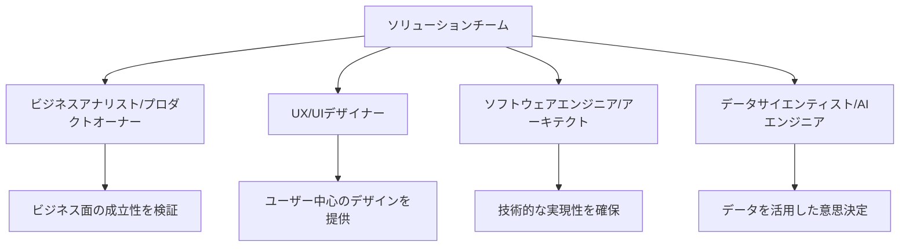

# ソリューション基礎

[TOC]


# 3限目: ソリューション基礎

## 1. イントロダクション 

### 1.1 自己紹介

#### 講師陣

```
名前: 小島 弘誉(こじま ひろたか)
専門分野: ソフトウェア工学
略歴: 
  通信事業会社にて6年、OpenStackを用いたパブリッククラウド(仮想サーバ)の開発・運用等を経験。
  本業以外でもグループ全体のアプリコンテストに出場し、UX賞、最優秀賞を受賞。  
  自動車部品メーカーにて3年、XP(Extreme Programming)を用いた新規事業(アプリ、プラットフォーム)開発を経験。   
  2021年12月より、日本の大企業で仮説検証を爆速に回せるか?の解を探して、現職。Solution Architectとして顧客が抱えている課題を解決するために日々、仮説検証を回す日々を奮闘中。     
```

```
名前: 竹田さん
専門分野: 
略歴: 
 
```

```
名前: 伊藤　尚祐(いとう なおすけ)
専門分野: 情報通信
略歴:
  大学卒業後、総合電機メーカーにて通信装置の研究開発に従事。その後、スタートアップにてIoTサービスの構築をリードした後、2022年より現職。
  現在、デザイン・シンキング等で出たアイデアを短期間で実装し、ユーザー価値・ビジネス価値の最大化に挑戦中。趣味はスケートボード（パリオリンピックに感化されスタート）。
```


### 1.2 目標と概要

#### コース概要

このコースの前半7回は、ソフトウェアアーキテクチャの基本的な概念とデザイン思考の原則を組み合わせることで、実践的なソリューションスキルを身につけさせることを目的とします。具体的なケーススタディを通して、理論と実践の両方を深く理解し、実世界の問題解決に応用できる能力を養います。    

| 回数     |           1            |               2               |               3               |                 4                 |                 5                 |                   6                   |                 7                 |        8-14         |
| -------- | :--------------------: | :---------------------------: | :---------------------------: | :-------------------------------: | :-------------------------------: | :-----------------------------------: | :-------------------------------: | :-----------------: |
| テーマ   | **ソリューション基礎** | ソリューションとデザイン思考① | ソリューションとデザイン思考② | ソリューションとテクノロジー①設計 | ソリューションとテクノロジー②開発 | ケーススタディ①ソリューションデザイン | ケーススタディ②ソリューション開発 |    Creative Hack    |
| 担当講師 |     **小島、竹田**     |             竹田              |             竹田              |               小島                |               小島                |              小島、竹田               |            小島、竹田             |     伊藤、小島      |
| 場所     |     **オンサイト**     |          オンサイト           |           リモート            |            オンサイト             |             リモート              |               リモート                |            オンサイト             | オンサイト/リモート |


## 2. 導入 (20分)

### 2.1 知っているソリューションを共有しよう (10分)

早速ですが、みなさんが知っているソリューションについて教えてください。  
自分の考えていることをslackのチャネルに書いてみましょう。  

```
名前: 
最近はまっていること・好きなこと: 
自分の知っているソリューションとは: 
```

### 2.2 AIにも聞いてみよう (5分)

> [!Note]
>
> まずはAI([ChatGPT](https://chatgpt.com/), [Gemini](https://gemini.google.com/app), [Perplexity](https://www.perplexity.ai/)等)にソリューションとは何か聞いてみましょう。
>
> ```
> (例)ソリューションとは何ですか?
> ```


### 2.3 AIを活用して理解を深めてみよう (5分)

> [!note]
>
> ソリューションとは何か理解できるまで深堀ってきいてみましょう。
> この授業ではAIを活用して、講義の内容をより深く理解してもらいたいと思っています。
>
> ```
> (例1)高校生でもわかるように説明してください。
> (例2)ソリューションを考えることは重要ですか。
> (例3)ソリューションとDXは違いますか。
> ```


## 3. ソリューション基礎 (15分)

### 3.1 ソリューションとは

ソリューションとは、特定の問題や課題を解決するための方法や手段を指す、非常に広い概念です。業界や分野に関係なく、何らかの問題に対して最適な解決策を提供することが「ソリューション」と呼ばれます。

### 3.2 様々なソリューション

さまざまな分野で活用されるソリューションが存在します。主要なソリューションの例を紹介します。

これらのソリューションは、業界や目的によって異なるものの、いずれも問題解決や効率向上を目的としています。ITソリューションはその中でもデジタル技術に特化しており、他のソリューションと組み合わせることで、さらに強力な結果を生み出すことができます。

#### 1. **ITソリューション**
   - **概要**: ITソリューションは、情報技術（IT）を活用して業務の課題を解決するための手段やサービスです。これにはソフトウェア、クラウドサービス、ネットワークインフラ、データ管理、サイバーセキュリティなどが含まれます。企業の業務効率化、データ活用、セキュリティ向上などを目的としています。
   - **例**: 企業が業務効率を改善するために、CRM（顧客管理システム）を導入したり、クラウドを使ってデータの保存や管理を行うこと。また、サイバー攻撃に備えてファイアウォールや暗号化技術を導入するなど。

#### 2. **ビジネスコンサルティングソリューション**
   - **概要**: 企業の経営課題や業務改善を支援するための戦略的なアドバイスや解決策を提供するソリューションです。組織改革、コスト削減、マーケティング戦略、人材管理などを含みます。
   - **例**: ある企業が売上を増加させるために、新しい市場参入戦略や販売チャネルの最適化を提案すること。

#### 3. **教育ソリューション**
   - **概要**: 教育に関連する課題を解決するための手段やプログラムです。リモート教育、カリキュラム開発、学習ツールの導入など、教育の質を高めるための解決策が含まれます。
   - **例**: オンライン学習プラットフォームの導入によって、遠隔地の生徒が授業に参加できる環境を整備すること。

#### 4. **医療ソリューション**
   - **概要**: 医療分野での課題を解決するための手段や技術です。新しい治療法や診断技術、医療機器、病院の業務効率化を含む広範な取り組みです。
   - **例**: AIを活用した画像診断技術を導入して、早期のがん発見を支援するなど、医療現場の質を向上させるソリューション。

#### 5. **環境ソリューション**
   - **概要**: 環境保護や持続可能な発展を支援するための解決策です。再生可能エネルギー、廃棄物管理、持続可能な農業や工業の技術などが含まれます。
   - **例**: 太陽光発電システムの導入によって、企業が化石燃料依存を減らし、CO2排出量を削減すること。

#### 6. **製造ソリューション**
   - **概要**: 製造業における生産効率向上やコスト削減を支援する解決策です。生産プロセスの自動化、品質管理の強化、サプライチェーンの最適化などが含まれます。
   - **例**: ロボティクスを活用して生産ラインを自動化し、製品の品質と生産速度を向上させること。

#### 7. **金融ソリューション**
   - **概要**: 金融業界での課題解決に関するソリューションです。資産運用、リスク管理、投資戦略、金融技術の導入などが含まれます。
   - **例**: 投資家向けにアルゴリズムトレーディングを導入し、リスクを最小限に抑えつつ、収益を最大化する戦略を提供すること。

#### 8. **物流ソリューション**
   - **概要**: 物流やサプライチェーンの課題を解決するための手段や技術です。倉庫管理システム、配送ルートの最適化、在庫管理の自動化などを通じて、効率を向上させます。
   - **例**: AIとIoTを活用して、在庫管理を自動化し、無駄な在庫や配送遅延を削減する。

#### 9. **人材ソリューション**
   - **概要**: 人材に関する課題を解決するための手段です。採用活動、社員教育、評価システム、従業員のモチベーション向上に関する取り組みが含まれます。
   - **例**: 企業が新しい採用プラットフォームを導入して、最適な人材を迅速に見つけ、育成プログラムを強化すること。

#### 10. **マーケティングソリューション**
   - **概要**: 企業のマーケティング活動を効率化し、効果を高めるためのソリューションです。データ分析、広告キャンペーン、ブランド戦略、顧客ターゲティングなどを通じて、企業の売上や認知度を向上させます。
   - **例**: 顧客データを分析し、個別化されたマーケティング戦略を立て、ターゲット顧客に最適な広告を提供すること。

#### 11. **法律・コンプライアンスソリューション**
   - **概要**: 法律や規制に対応し、企業がコンプライアンスを遵守できるよう支援するソリューションです。法的リスク管理、コンプライアンス体制の強化、規制対応策の策定などが含まれます。
   - **例**: データ保護法に対応するための内部監査プロセスや、企業が新しい規制に適応するためのコンプライアンスプログラムを導入すること。


### 3.3 密接に関連するITと様々なソリューション

<u>**本講義では特に情報技術（IT）を使って問題を解決するための手段やサービスを指す`ITソリューション`に特化して講義を進めます。**</u>

ITソリューションは多くの業界での問題解決において、強力な支援役や土台となる存在です。以下に、ITソリューションと他の分野のソリューションがどのように関係しているかを説明します。

####  1. **ビジネスコンサルティングソリューションとITの関係**

- **ITの役割**: ビジネスコンサルティングにおいて、ITは企業の業務効率や戦略的な意思決定を支える重要な要素です。ITソリューションは、データ分析、ERPシステム、CRM（顧客管理システム）などの技術を活用して、業務の最適化や経営戦略の実行を支援します。これにより、ビジネスプロセスのデジタル化や、競争力の強化が可能になります。
- **例**: ある企業がコスト削減や業務効率化を目指してビジネスコンサルタントを導入した場合、その解決策としてITシステムの導入が提案されることがあります。例えば、ERPシステムを導入することで、経理、物流、在庫管理などの業務を一元管理し、運用の効率化を図ることができます。

#### 2. **教育ソリューションとITの関係**

- **ITの役割**: 教育の分野では、オンライン学習プラットフォームやデジタル教材、AIを活用した学習サポートツールがITソリューションとして導入されることが多いです。これにより、教育の質を向上させ、リモート教育やハイブリッド学習が可能になります。
- **例**: COVID-19のパンデミックの際、多くの学校や大学がZoomやGoogle ClassroomなどのITツールを使って授業を続けたことは、ITソリューションの教育分野への貢献の良い例です。

#### 3. **医療ソリューションとITの関係**

- **ITの役割**: 医療分野でも、ITソリューションは非常に重要です。電子カルテシステム、AIによる診断支援ツール、リモート診療システムなどが導入され、医療の効率と精度を高めています。
- **例**: 医師がAIを活用して画像診断を行い、がんの早期発見や診断精度を向上させることは、ITソリューションの医療分野での具体的な例です。


<div style="text-align: center;">    <a href="https://www.soumu.go.jp/johotsusintokei/whitepaper/ja/r01/html/nb000000.html">引用: 令和元年版　情報通信白書のポイント</a> </div>

### 3.4 現代においてソリューションが重要な理由

今の時代に<u>ソリューションを考えることが重要な理由は、技術革新や社会の変化が加速する中で、企業や個人が直面する課題が複雑化しているため</u>です。効果的なソリューションを設計・提供することは、競争力を維持し、持続可能な成長を実現するために欠かせません。以下は、特に現代においてソリューションを考えることが重要な理由です。

#### 1. **デジタル化と技術進化の加速**

AI、IoT、クラウドコンピューティングなどの技術は急速に進化しており、それに伴い新しい課題が生まれています。これらの技術を最大限に活用し、問題を解決するためのソリューションを設計できる企業や個人が、成功する可能性が高まります。現代の課題は従来の手法では対応できないことが多く、革新的なソリューションが必要です。

#### 2. **顧客のニーズの多様化**

消費者やビジネス顧客の期待や要求は多様化しており、個々のニーズに適応したソリューションが求められます。標準化された製品やサービスだけでは顧客の満足を得られず、カスタマイズや柔軟な対応が可能なソリューションの設計が重要です。

#### 3. **グローバル化による競争の激化**

グローバル市場での競争は激化しており、差別化されたソリューションを提供できるかどうかが、企業の成功を左右します。単なる製品やサービスの提供だけでなく、他社と異なる価値を提供するためのソリューションを考え出すことが、競争優位を保つカギです。

#### 4. **持続可能性への意識の高まり**

環境問題や社会的課題に対する関心が高まる中、持続可能なソリューションの設計が重要視されています。企業は、環境負荷を減らすソリューションや社会的責任を果たすためのソリューションを提供することが求められており、これが新たなビジネスチャンスにもつながっています。

#### 5. **AI時代のソリューション設計**

AI時代において、単にコーディングを行うだけでなく、AIを活用した革新的なソリューションを考え出すことが重要になります。ソリューション設計は、どの技術をどのように適用するか、あるいは新しい技術をどのように導入するかを決定するプロセスです。AIの進化により、業務の自動化やデータ分析の高度化が進んでいますが、それらをどのように効果的に活用するかが成否を分けます。

#### 6. **迅速な変化に対応する必要性**

ビジネス環境は急速に変化しており、予測できない状況にも迅速に対応する必要があります。変化に対応できる柔軟なソリューションを持つことで、危機を乗り越え、持続的な成功を収めることが可能です。

以上のように、現代においてソリューションを考えることは、競争優位性の確保、顧客満足の向上、技術の進化への対応、そして持続可能な未来を築くために非常に重要です。


## 4. ソリューションデザインプロセス (20分)

本講義では従来活用されていた/現在活用されている人気のあるソリューションデザインプロセスを4つ説明します。

### 4.1 **ウォーターフォール型プロセス**

ウォーターフォール（滝）型は、直線的で順序だてたプロセスです。各フェーズが完了した後に次のフェーズへ進むという順序で行われます。ソリューションデザインでも従来からよく使われています。ウォーターフォール型プロセスは、各フェーズが順番に進み、前のフェーズに戻ることはあまり想定されていません。

- **メリット**: 明確な段階と成果物があり、計画が管理しやすい。
- **デメリット**: 変更に柔軟に対応しづらく、後戻りが難しい。

#### 各ステップの説明:

1. **要件定義**: ユーザーやクライアントの要求を把握し、必要な機能や仕様を定義します。
2. **システム設計**: 要件を基にシステムの設計を行います。基本設計や詳細設計などを含みます。
3. **実装**: 設計されたシステムやソフトウェアを実際にコーディングして作成します。
4. **テスト**: 作成されたシステムをテストし、問題やバグがないか確認します。
5. **展開**: テストを通過したシステムを実際の運用環境に導入します。
6. **保守**: システムが導入された後、運用中に発生する問題に対応し、必要に応じて改善や修正を行います。




### 4.2. **アジャイル型プロセス**

アジャイルプロセスは、反復的かつ段階的な方法で進める手法です。ソリューションをスプリント（短期間の開発サイクル）で開発し、その都度フィードバックを受け、設計や実装を修正・改善していきます。

- **メリット**: 柔軟に変更対応ができ、早い段階で価値を提供できる。
- **デメリット**: 長期的な計画が見えにくくなることがある。

#### 各ステップの説明:

1. **プロダクトバックログ**: 開発すべき機能や要件のリスト（プロダクトバックログ）を用意し、優先度を決めます。
2. **スプリントプランニング**: スプリントの開始時に、どの機能やタスクを実行するかを計画します。
3. **設計**: 選ばれた機能に対する設計を行います。
4. **実装**: 設計に基づいてコーディングを行います。
5. **テスト**: 実装された機能が正しく動作するかをテストします。
6. **デプロイ**: テストが完了したら、機能を実際の環境にデプロイします。
7. **スプリントレビュー**: スプリント終了時に、完成した機能をステークホルダーにデモしてフィードバックを得ます。
8. **スプリントレトロスペクティブ**: スプリント全体を振り返り、プロセスやコミュニケーションの改善点を話し合います。




### 4.3. **デザインシンキング**

デザインシンキングは、ユーザー中心のアプローチで、問題の深い理解を得るために使われます。共感から始まり、プロトタイピングやテストを繰り返し、ユーザーに最適なソリューションをデザインするプロセスです。

- **メリット**: ユーザー視点に立ち、イノベーティブなソリューションを導き出せる。
- **デメリット**: 時間がかかる場合があり、実際の実装に進むまでにリソースが必要。

#### 各ステップの説明:

1. **共感（Empathize）**: ユーザーのニーズや課題を深く理解するために、観察やインタビューを通してユーザーに共感します。
2. **問題定義（Define）**: 共感フェーズで得た情報を元に、解決すべき問題を明確に定義します。
3. **アイデア発想（Ideate）**: クリエイティブなアイデアを出し合い、解決策を幅広く検討します。ブレインストーミングがよく使われます。
4. **プロトタイピング（Prototype）**: 出されたアイデアを元に、簡単な試作品やプロトタイプを作成し、実現可能性をテストします。
5. **テスト（Test）**: プロトタイプをユーザーに試してもらい、フィードバックを得て改良を加えます。
6. **問題は解決したか？(フィードバックループ)**: テストの結果、問題が解決していれば、実装や展開に進みます。解決していない場合は、再度「問題定義」や「アイデア発想」に戻り、改善を繰り返します。




### 4.4 **LEAN型プロセス**

リーン（LEAN）プロセスは、無駄を省き、最も価値のある作業に集中することに重点を置きます。リソースを最小限に抑えながら、効率的にソリューションを提供する方法です。

- **メリット**: 効率が高く、コスト削減が期待できる。
- **デメリット**: 余剰のリソースやプロセスを削りすぎて柔軟性を損なう可能性がある

#### 各ステップの説明:

1. **顧客の価値を特定（Identify Value）**: 顧客にとって最も重要な価値は何かを明確にします。これがLEANプロセスの出発点です。
2. **バリューストリームの可視化（Map the Value Stream）**: 価値を生み出すための全プロセス（バリューストリーム）を可視化し、どこに無駄があるかを確認します。
3. **フローの改善（Create Flow）**: 無駄を取り除き、価値が滞りなく顧客に届くようにプロセス全体の流れを最適化します。
4. **プル型システムの構築（Establish Pull）**: 必要なものを必要なタイミングで生産する「プル型システム」を導入し、在庫や過剰な作業を防ぎます。
5. **継続的改善（Seek Perfection / Continuous Improvement）**: 改善を繰り返し、プロセスを常に最適化し続けます。これはLEANの核心となる考え方です。
6. **無駄はなくなったか？(フィードバックループ):** 無駄が完全に排除されたかどうかを確認し、もしまだ無駄が残っていれば「フローの改善」に戻ってさらなる最適化を行います。




### 4.5 興味をもったソリューションデザインプロセスを共有しよう

> [!Note]
>
> 自分が興味をもったソリューションデザインプロセスはどれでしょうか?
> 理由とともにslackに投稿してみましょう。
>
> ```
> 興味をもったソリューションデザインプロセス:
> なぜそのデザインプロセスに興味をもったか?:
> ```


## 5. ソリューションデザインと多様性 (20分)

### 5.1 ソリューションデザインと3つの価値

**ビジネス**、**デザイン**、**テクノロジー**の3つのバランスは、ソリューションを考える際に非常に重要で、これらの視点を統合することがソリューションをデザインする上で成功の鍵となります。この考え方は、「**イノベーションの3つのレンズ**」としても知られており、多くの企業やデザインフレームワークで採用されています。

#### 1. **デザイン（Human Desirability）**

- **目的**: ソリューションが人々に求められるか、使いやすいか、魅力的か。
- **質問**: ユーザーにとって本当に必要なものか？使いやすい、もしくは欲しいものか？ユーザー体験が最適化されているか？
- **重要性**: ユーザーが使いたい、または使うことで生活や業務が改善されるものでなければ、ソリューションは採用されません。

#### 2. **テクノロジー（Technical Feasibility）**

- **目的**: ソリューションが技術的に実現可能か、現実的に構築できるか。
- **質問**: 必要な技術はあるか？開発可能なリソースやスキルが社内にあるか？技術的な障害はクリアできるか？
- **重要性**: デザインが魅力的でも、技術的に実現不可能であれば意味がありません。また、持続可能なインフラとシステムがないと、運用が困難になります。

#### 3. **ビジネス（Business Viability）**

- **目的**: ソリューションがビジネスとして成立するかどうか（収益性、持続可能性）。
- **質問**: 提供するソリューションは、市場に価値を提供し、経済的に成立するのか？ビジネスモデルはどうか？
- **重要性**: いくら優れた技術やデザインでも、ビジネスとして成立しなければ、持続的な成長や資源の確保は難しいです。





### 5.2. ソリューション実現するための役割

より良いソリューションを提供するためには、チームに多様なスキルセットや視点を持つメンバーを集めることが非常に重要です。現在はビジネス、デザイン、テクノロジーの3つのバランスを考慮した「イノベーションの3つのレンズ」に基づいて構成するのが効果的です。

#### ビジネスアナリスト/プロダクトオーナー

**役割**: 市場のニーズ、競合分析、ビジネスの方向性を決定し、プロダクトのビジネス的価値を最大化するための戦略を策定する。

**スキル**: ビジネスモデルの理解、マーケット分析、プロジェクトの収益性評価。

**目的**: ソリューションがビジネス的に成立するかどうか、実行可能性やリターンを考慮して進めます。

#### UI/UXデザイナー

**役割**: ユーザーリサーチを基に、ユーザーにとって使いやすく、魅力的な体験を提供するためのデザインを行う。

**スキル**: ユーザー中心設計、プロトタイピング、情報アーキテクチャ、ユーザビリティテスト。

**目的**: ソリューションがユーザーにとって望ましいものであるかを確認し、ユーザー体験を最適化します。

#### エンジニア/IT`アーキテクト

**役割**: ソリューションの技術的実現を担当し、設計した機能を技術的に実装する。テクノロジーの選定やインフラ設計にも関与。

**スキル**: システム設計、プログラミング、データベース管理、クラウドインフラ構築。

**目的**: デザインやビジネス要件を満たしながら、技術的に可能な範囲で最適なソリューションを構築します。

#### データサイエンティスト/AIエンジニア

**役割**: 市場データ、ユーザー行動データ、その他の情報を解析して、データに基づいた意思決定をサポートする。

**スキル**: データ解析、統計、AIや機械学習の知識、データビジュアライゼーション。

**目的**: ユーザーのフィードバックや市場動向を基に、デザインやビジネス戦略をデータに基づいて最適化します。




<div style="text-align: center;">    <a href="https://www.meti.go.jp/policy/it_policy/jinzai/skill_standard/20240708-gp-1.pdf">引用: デジタルスキル標準 ver.1.2＜改定後概要版＞（PDF形式：1,210KB）</a> </div>

### 5.3 日本の構造問題と求めらるITスキル人材 


## 7. ソリューション事例 (15分)

### 7.1 事例① **メルカリ（Mercari）**


**メルカリ（Mercari）**の事例は、日本発のC2C（消費者間取引）プラットフォームとして成長し、国内外で大きな市場シェアを獲得した例です。メルカリは、ユーザーが簡単に不要な物を出品・購入できるモバイルアプリを提供しており、特にスマートフォンを活用した利便性の高い取引プラットフォームとして支持を集めています。デザインシンキングや先進的な技術の導入を通じて、顧客体験の向上やサービスの差別化に成功しました。

#### 7.1.1 背景

メルカリは2013年に創業され、日本国内で最も成功したモバイルC2Cマーケットプレイスの一つです。従来、個人間取引はヤフオクやリサイクルショップなどで行われていましたが、それらはPCベースで手続きが煩雑であり、モバイルの普及とともに使い勝手が課題となっていました。

メルカリは、この市場の隙間を埋めるために、特にスマートフォンでのシンプルかつスピーディーなユーザー体験に焦点を当てたサービスを提供しました。

#### 7.1.2 課題

メルカリが解決しようとした課題は、以下のようなものでした：

1. **手軽な取引体験の提供**: 出品や購入の手続きが複雑で、ユーザーが気軽に商品を売買できる場が不足していました。
2. **ユーザー間の信頼性の確保**: 個人間取引において、信頼性や安全性が不安視されていました。特に、不正取引や商品の状態に関する不安が存在しました。
3. **スマートフォン向けのシームレスな操作**: モバイル端末の普及に伴い、PCベースの既存サービスに代わる、スマホに特化したプラットフォームが求められていました。

#### 7.1.3 メルカリのソリューション

メルカリは、上記の課題に対して、直感的で使いやすいモバイルアプリを提供し、C2C取引をより手軽に、安全に行えるようにしました。特に、デザインシンキングを取り入れ、ユーザー中心のアプローチでソリューションを開発しました。

##### **手軽な取引体験の実現**

メルカリは、出品から販売までの手続きが非常に簡単に行えるユーザーインターフェース（UI）を開発しました。特に、スマホで商品の写真を撮ってすぐに出品できるという簡便さがユーザーに高く評価されました。

- **シンプルな出品プロセス**: 商品の写真を撮影し、簡単な説明を入力して出品までを数ステップで完了できる設計。ユーザーに手間をかけさせないUI/UXが、初心者でもすぐに使えるポイントとなりました。
- **プッシュ通知による取引の促進**: 販売や購入の状況がリアルタイムで通知されるため、取引がスムーズに進行します。これにより、ユーザーは取引状況を常に把握でき、迅速な対応が可能となりました。

##### **信頼性の確保**

C2Cプラットフォームにおいて、取引の信頼性を高めるための機能が実装されました。メルカリは、取引の安全性を担保するために以下のソリューションを導入しました。

- **メルカリ独自の「匿名配送」システム**: ユーザーが自分の住所や氏名を公開せずに、商品を安全に発送・受け取りできる匿名配送サービスを提供。この機能により、個人情報漏洩のリスクが軽減され、安心して取引できる環境が整いました。
- **決済保留システム**: メルカリは、商品の到着後に購入者が確認してから出品者に代金を支払う仕組みを導入。これにより、不良品や未着のトラブルを防ぎ、取引の信頼性を確保しました。
- **ユーザー評価システム**: 取引後にユーザー同士がお互いを評価できるシステムを導入。これにより、信頼できるユーザーを可視化し、不正行為を未然に防ぐことができました。

##### **スマホ特化型プラットフォームの強化**

スマートフォンでの操作性に重点を置き、メルカリは、モバイルユーザーがストレスなく取引を行える環境を整備しました。

- **モバイルファーストの設計**: メルカリはスマホ向けに最適化されたUI/UXを追求し、タップ操作やスクロールの快適さに配慮しました。すべての取引がスマホ上で完結できるという利便性が、ユーザー獲得に大きく貢献しました。
- **AIとデータ分析の活用**: AIを活用して、ユーザーが興味を持ちそうな商品をレコメンドする機能を実装。また、画像認識技術により、出品時に商品カテゴリやキーワードを自動で提案することで、出品の簡便さをさらに強化しました。

#### 7.1.4 成果と成功要因

##### 成果

- **急速なユーザー獲得と市場拡大**: メルカリは、シンプルで使いやすい取引体験と安全な取引環境により、短期間で日本国内外で数千万人のユーザーを獲得。特に、日本国内のC2Cマーケットプレイスとして圧倒的なシェアを誇っています。
- **継続的な機能改善とデザイン改良**: デザインシンキングのアプローチにより、ユーザーのフィードバックをもとにUI/UXを継続的に改善し、リピート利用率を向上させました。
- **グローバル展開の成功**: メルカリは、日本国内の成功を足がかりに、アメリカ市場にも進出。モバイルに特化したC2C取引プラットフォームとして国際的な評価を得ました。

##### 成功要因

- **ユーザー中心のデザインシンキング**: メルカリは、ユーザーが何を求めているかを徹底的に理解し、誰でも簡単に使えるモバイルプラットフォームを構築したことが成功の鍵となりました。特に、スマホ操作の快適さと簡便さに焦点を当てたUI/UXが大きな強みです。
- **信頼性を重視した仕組み**: 個人間取引のリスクを軽減するための匿名配送や決済保留システムが、ユーザーに安心感を提供し、取引を促進しました。
- **テクノロジーの積極活用**: AIやデータ分析を活用して、出品・購入の利便性を高め、ユーザーに適切な商品をレコメンドすることで、ユーザーエクスペリエンスを向上させました。

---

#### 7.1.5 メルカリと3つのレンズ

##### **デザイン（Human Desirability）**

メルカリは、ユーザーが求めるシンプルさ、利便性、安心感に応えるために、顧客の視点に立ったデザインを追求しました。この**デザインシンキング**のアプローチが、ユーザーの使い勝手を高め、短期間で多くのユーザーを獲得できた大きな要因です。

- **ユーザー中心の使いやすさ**: メルカリは、特に初心者やテクノロジーに慣れていない人でも簡単に利用できるシンプルで直感的なユーザーインターフェース（UI）を提供しました。出品から販売までのプロセスを数タップで完了できるため、手間をかけずに商品を売買できるという点がユーザーに強く支持されました。
- **匿名配送と評価システム**: C2C取引におけるユーザー間の信頼性の問題を解決するために、匿名配送や取引後の評価システムを導入し、安全かつ安心して取引できる環境を構築しました。これにより、初めての利用者でも心理的な障壁を感じずに取引を始められ、ユーザーの不安を解消しました。
- **モバイルファーストの設計**: メルカリは、スマートフォンの普及に対応し、完全にモバイルに最適化された設計を行いました。PCベースの他のプラットフォームに比べ、移動中や空き時間にも簡単に取引ができるという利便性が、特に若年層を中心に高く評価されました。

##### **テクノロジー（Technical Feasibility）**

メルカリは、最新のモバイル技術とAI、データ分析を効果的に活用することで、技術的な可能性を最大限に引き出しました。これにより、使いやすさと機能の両立が実現し、競合他社との差別化に成功しています。

- **モバイルアプリの最適化**: メルカリは、スマートフォン上でスムーズに動作するモバイルアプリケーションを提供し、操作性に優れたUXを実現しました。また、システムの軽量化とリアルタイム通信技術を駆使して、商品出品や購入が迅速に行えるプラットフォームを構築しました。
- **AIとデータ分析**: AIを活用して、商品レコメンデーション機能を強化。これにより、ユーザーは自分の興味に合った商品を簡単に見つけることができ、売り手側も適切な価格設定や販売機会の増加を実感できました。また、画像認識技術を活用し、出品時に自動で商品カテゴリやキーワードを提案する機能を実装し、出品プロセスの効率化を図りました。
- **安全な決済システム**: メルカリは、購入者が商品を確認してから代金を支払う「決済保留システム」を導入しました。これにより、詐欺や不正取引のリスクを減少させ、ユーザーが安心して取引できるようになりました。

##### **ビジネス（Business Viability）**

メルカリは、手数料収益モデルのシンプルさと拡張性を活かし、国内外での成長を実現しました。さらに、社会的なニーズにも応えつつ、企業としての収益性を高めるビジネスモデルを確立しました。

- **手数料ビジネスモデルの成功**: メルカリは、ユーザーが商品を売買するたびに手数料を得るビジネスモデルを採用しました。このモデルは、売買の活発化とともに収益が拡大するため、ユーザー数の増加とともに安定した収益源を確保できました。また、課金体系もシンプルで、ユーザーが取引の手軽さを感じながら利用できる仕組みを提供しています。
- **規模の拡大と市場拡張**: メルカリは、成功したビジネスモデルを日本国内だけでなく、アメリカ市場にも展開しました。特にアメリカ市場では、現地ユーザーに合わせたローカライズを行い、マーケティング活動を強化。国際展開によりさらなる成長を図りました。
- **サステナビリティとリサイクル市場の拡大**: メルカリは、物の再利用を促進し、サステナブルな消費を支援するビジネスモデルとして、環境意識の高い消費者にも訴求しました。この「もったいない」文化に合致する事業展開が、社会的価値の提供にもつながり、ブランドイメージの向上に貢献しています。


#### 7.1.6 補足: メルカリのアーキテクチャ改善


<div style="text-align: center;">  2018年のアーキテクチャ<a href="https://engineering.mercari.com/blog/entry/20220830-15d4e8480e/"> [メルカリWebのマイクロサービス化、その4年より]</a> </div>


<div style="text-align: center;">  2022年のアーキテクチャ<a href="https://engineering.mercari.com/blog/entry/20220830-15d4e8480e/"> [メルカリWebのマイクロサービス化、その4年より]</a> </div>


### 7.2 ソリューション事例② [Salesforce - 旅館「陣屋」のCRM導入事例](https://www.salesforce.com/jp/customer-success-stories/jinya/)

Salesforceと旅館「陣屋」の事例は、Salesforceが提供するCRM（顧客関係管理）ソリューションを活用し、伝統的な日本の旅館である陣屋が、デジタルツールを導入して業務効率化とパーソナライズされた顧客サービスを実現した成功事例です。これにより、陣屋はホスピタリティ業界の変化に迅速に対応し、個々の顧客に合った体験を提供できるようになりました。

### 背景

陣屋は、100年以上の歴史を持つ日本の老舗旅館であり、長い間、質の高いサービスで多くの顧客をもてなしてきました。しかし、近年では競争が激化し、顧客のニーズも多様化したため、以下の課題に直面していました。

- **顧客情報管理の煩雑さ**: 手作業で管理していた顧客データは分散しており、正確な顧客情報の把握や管理が難しかった。
- **パーソナライズされたサービスの不足**: 顧客ごとのニーズや嗜好に応じた個別対応が困難で、他の宿泊施設との差別化が難しくなっていました。
- **業務プロセスの非効率性**: 予約管理や顧客対応に手作業が多く、従業員の業務負担が大きく、サービス品質の維持が課題となっていました。

これらの課題を解決するために、陣屋はSalesforceのCRMシステムを導入し、顧客体験の向上と業務の効率化を図ることを決定しました。

### 課題

陣屋が直面していた主な課題は、顧客データの統合、パーソナライズされたサービスの提供、そして業務効率の向上でした。特に以下の3つの課題に対して解決策が求められていました。

1. **顧客データの一元管理**: 顧客情報が分散しており、正確に管理することが難しいため、データを統合し、一元管理する必要がありました。
2. **顧客満足度の向上**: 顧客ごとに個別のニーズに応じたパーソナライズされたサービスの提供が必要でした。
3. **業務の自動化と効率化**: 予約管理や顧客対応をデジタル化し、手作業による非効率な業務を改善することが求められていました。

### Salesforceのソリューション

Salesforceは、これらの課題に対し、クラウドベースのCRMソリューションを陣屋に提供しました。これにより、顧客情報を一元管理し、予約管理やパーソナライズされたサービスの提供を自動化しました。

#### 1. **顧客データの統合**

SalesforceのCRMソリューションにより、陣屋は顧客データを一元的に管理できるようになりました。これにより、過去の宿泊履歴や嗜好に基づいて顧客を把握し、より精度の高い顧客サービスを提供できるようになりました。

- **リアルタイムでの顧客情報管理**: Salesforceを活用し、全ての顧客情報をリアルタイムで更新・管理。従業員はどの端末からでも情報にアクセスでき、顧客への対応スピードが向上しました。

#### 2. **パーソナライズサービスの強化**

顧客の宿泊履歴や好みに基づいた個別対応ができるようになり、よりパーソナライズされたサービスを提供できるようになりました。

- **顧客嗜好に基づくサービス提供**: SalesforceのCRMにより、顧客の嗜好やリクエストを詳細に記録・追跡することで、次回宿泊時に個別対応が可能に。これにより、顧客満足度が向上しました。

#### 3. **業務プロセスの効率化**

Salesforceによって、予約管理や顧客対応が自動化され、手作業のプロセスが減少しました。これにより、業務効率が大幅に向上しました。

- **予約システムの自動化**: CRMシステムにより、予約の確認や変更が自動で行えるようになり、従業員の業務負担が軽減され、より迅速な対応が可能になりました。

### 成果と成功要因

#### 成果

- **顧客データ管理の改善**: Salesforceを導入することで、顧客情報が一元管理され、正確で効率的な顧客対応が可能になりました。
- **パーソナライズされた顧客対応**: 顧客ごとのニーズに応じた個別サービスが強化され、リピーターが増加しました。
- **業務効率の向上**: 手作業で行っていた予約管理や顧客対応が自動化され、業務効率が大幅に改善されました。

#### 成功要因

- **顧客データの統合と活用**: 顧客データをリアルタイムで一元管理することで、正確かつ迅速なサービス提供が可能になりました。
- **パーソナライズサービスの強化**: 顧客の嗜好や過去の利用履歴をもとに、パーソナライズされたサービスを提供することで、顧客満足度が向上しました。
- **自動化による業務効率化**: Salesforceの自動化機能を活用して、従業員の業務負担を軽減し、サービス品質を維持しつつ業務効率を向上させました。

------

#### 1. **デザイン（Human Desirability）**

陣屋のSalesforce導入は、顧客一人ひとりに対してパーソナライズされた体験を提供し、顧客満足度を向上させました。また、従業員の業務負担を軽減し、効率的なサービス提供を実現しました。

- **顧客データの可視化**: Salesforceを活用して、顧客の宿泊履歴や嗜好をリアルタイムで把握し、個々の顧客に合ったサービスを提供できるようになりました。
- **パーソナライズされた体験の提供**: それぞれの顧客に応じたきめ細かい対応ができるようになり、リピーターの増加に寄与しました。

#### 2. **テクノロジー（Technical Feasibility）**

SalesforceのクラウドベースのCRM技術を活用することで、データの一元管理と業務プロセスの自動化を実現し、陣屋の業務効率化が進みました。

- **クラウドベースのCRM導入**: Salesforceのクラウド技術により、顧客データの効率的な管理が実現され、どこからでも情報にアクセスできる環境が整いました。
- **業務の自動化**: 予約管理や顧客対応の自動化により、従業員の手間が削減され、効率的な運営が可能になりました。

#### 3. **ビジネス（Business Viability）**

Salesforce導入によって、陣屋はパーソナライズされたサービス提供と業務効率化を両立し、売上の向上とコスト削減を達成しました。

- **売上向上**: パーソナライズサービスによって顧客満足度が向上し、リピーターの増加につながりました。
- **コスト削減と業務効率化**: 自動化による業務効率化により、手作業の業務が減少し、コスト削減が実現されました。


## 4限目: 身近なソリューションの調査と発表


ソリューションとは何かを深く理解するために、学生の皆さんに身近に存在するソリューションやサービスについて調査し、発表していただきます。ソリューションとは、特定の課題や問題に対する解決策を指し、日常的に利用している製品やサービスの多くも、何らかの問題を解決するために提供されています。

#### Step1. 調査対象の選定 (10分)

#### Step2. ソリューションの理解 (20分) 

#### Step3. 価値の整理と考察 (20分)

#### Step4. 発表 (40分) ※3分/人

テンプレート案:

```
名前: 
学籍番号: 

# 身近なソリューションの調査

## 1.調査対象選定

候補一覧:
- 候補1
- 候補2
- 候補3

選定したソリューション: 〇〇〇
選定した理由:
〇〇〇

## 2.ソリューションの理解
背景:

課題:

ソリューション:


## 3.価値の整理と考察
1. デザイン（Human Desirability）
- 
2. テクノロジー（Technical Feasibility
- 
3. ビジネス（Business Viability）
-

# 感想


```


## 参考

1. ### [ChatGPT](https://chatgpt.com/)

2. ### [Lean Startup, Business Model Design, or Design Thinking?” is the Wrong Question](https://www.leanfoundry.com/articles/lean-startup-business-model-design-or-design-thinking-is-the-wrong-question)

3. ### [2023 is the year of ‘The Autonomous Enterprise’ as economics trigger change](https://www.horsesforsources.com/2023-autonomous-enterprise_121422/)

4. ### [ＩＴ人材育成の状況等について 経済産業省 商務情報政策局 情報処理振興課](https://www.meti.go.jp/shingikai/economy/daiyoji_sangyo_skill/pdf/001_s03_00.pdf)

5. ### [令和元年版　情報通信白書のポイント 総務省](https://www.soumu.go.jp/johotsusintokei/whitepaper/ja/r01/html/nb000000.html)

6. ### [ How To Become An Outstanding Solution Architect](https://ibm-learning.udemy.com/course/how-to-become-an-outstanding-solution-architect/)

7. ### [IDEO Design Thinking Defined](https://designthinking.ideo.com/)

8. ### [メルカリWebのマイクロサービス化、その4年](https://engineering.mercari.com/blog/entry/20220830-15d4e8480e/)

9. ### [メルカリ 希代のスタートアップ、野心と焦りと挑戦の5年間](https://www.amazon.co.jp/%E3%83%A1%E3%83%AB%E3%82%AB%E3%83%AA-%E5%B8%8C%E4%BB%A3%E3%81%AE%E3%82%B9%E3%82%BF%E3%83%BC%E3%83%88%E3%82%A2%E3%83%83%E3%83%97%E3%80%81%E9%87%8E%E5%BF%83%E3%81%A8%E7%84%A6%E3%82%8A%E3%81%A8%E6%8C%91%E6%88%A6%E3%81%AE5%E5%B9%B4%E9%96%93-%E5%A5%A5%E5%B9%B3-%E5%92%8C%E8%A1%8C/dp/4822289508) 

10. ### [Salesforce 成功事例 陣屋](https://www.salesforce.com/jp/customer-success-stories/jinya/)

