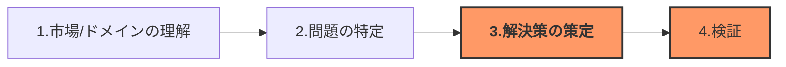

# ソリューション基礎


## 3限目: ソリューション基礎

## 3.1 イントロダクション 

### 3.1.1 自己紹介

#### 講師陣

```
名前: 小島 弘誉(こじま ひろたか)
専門分野: ソフトウェア工学
略歴: 
  通信事業会社にて6年、OpenStackを用いたパブリッククラウド(仮想サーバ)の開発・運用等を経験。
  本業以外でもグループ全体のアプリコンテストに出場し、UX賞、最優秀賞を受賞。  
  自動車部品メーカーにて3年、XP(Extreme Programming)を用いた新規事業(アプリ、プラットフォーム)開発を経験。   
  2021年12月より、日本の大企業で仮説検証を爆速に回せるか?の解を探して、現職。Solution Architectとして顧客が抱えている課題を解決するために日々、仮説検証を回す日々を奮闘中。     
```

```
名前: 竹田さん
専門分野: 
略歴: 
 
```

```
名前: 伊藤　尚祐(いとう なおすけ)
専門分野: 情報通信
略歴:
  大学卒業後、総合電機メーカーにて通信装置の研究開発に従事。その後、スタートアップにてIoTサービスの構築をリードした後、2022年より現職。
  現在、デザイン・シンキング等で出たアイデアを短期間で実装し、ユーザー価値・ビジネス価値の最大化に挑戦中。趣味はマリオカート（仮）。
```


### 3.2 目標と概要

#### コース概要

このコースの前半7回は、ソフトウェアアーキテクチャの基本的な概念とデザイン思考の原則を組み合わせることで、実践的なソリューションスキルを身につけさせることを目的とします。具体的なケーススタディを通して、理論と実践の両方を深く理解し、実世界の問題解決に応用できる能力を養います。    

| 回数     |         1          |               2               |               3               |          4           |          5           |                   6                   |                 7                 |     8-14      |
| -------- | :----------------: | :---------------------------: | :---------------------------: | :------------------: | :------------------: | :-----------------------------------: | :-------------------------------: | :-----------: |
| テーマ   | ソリューション基礎 | ソリューションとデザイン思考① | ソリューションとデザイン指向② | ソリューションの設計 | ソリューションの開発 | ケーススタディ①ソリューションデザイン | ケーススタディ②ソリューション開発 | Creative Hack |
| 担当講師 |     小島、竹田     |             竹田              |             竹田              |         小島         |         小島         |              小島、竹田               |            小島、竹田             |  伊藤、小島   |


## 3.3 アイスブレーク (10分) 

### TBD

```

```


## 3.4 ソリューションとアーキテクト

### 3.4.1 ソリューション実現プロセスと今回の位置づけ



### 3.4.2 解決策定のプロセス

1. ユーザーレベルでの解決策
   1. アイディアの発散
   2. 解決策の絞り込み
      1. ユーザー価値
      2. ビジネス価値
      3. ユーザー価値
2. 実現方法の決定
   1. 最終ゴールの理解とロードマップ整理
   2. アーキテクチャの決定


## 3.5 アーキテクチャ

### 3.5.1 アーキテクチャとは

### 3.5.2 アーキテクチャが重要な理由

##### ・策定したアイディアは実現できるのか?

##### ・最短経路を走ろう

> [!NOTE]
>
> 犠牲的アーキテクチャ vs 進化的アーキテクチャ

##### ・チームで開発することを見据えて

### 3.5.3 アーキテクチャ策定方法

#### 3.5.3.1 アーキテクチャドライバ (重要な要素)の特定

#### 3.5.3.2 アーキテクチャ案の洗い出し

#### 3.5.3.3 アーキテクチャの決定

- セキュリティ的に問題ないか?
- 拡張性はあるか?
- チームで開発できるか?

> [!NOTE]
>
> 機能要件と非機能要件


### 3.5.4 ソリューション事例とアーキテクチャ


### 3.5.5 アーキテクチャを定義してみよう

パズルを用いて、アーキテクチャを定義してみよう。

> [!IMPORTANT]
>
> アーキテクチャドライバを選定後、
>
> Muralを使ってアーキテクチャを描いてみよう。


## 3.6 先人の知恵を活用しよう

#### アーキテクチャスタイル

#### アーキテクチャパターン


