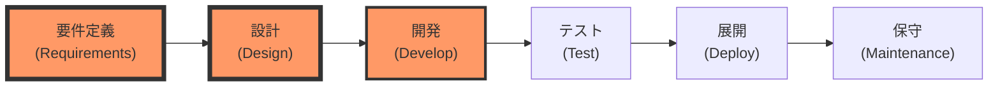
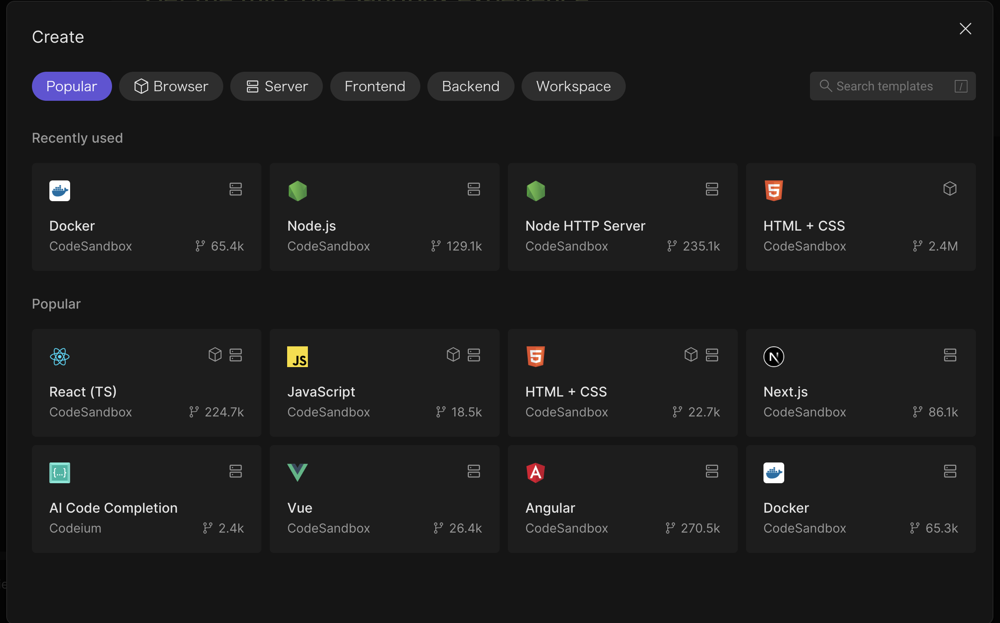
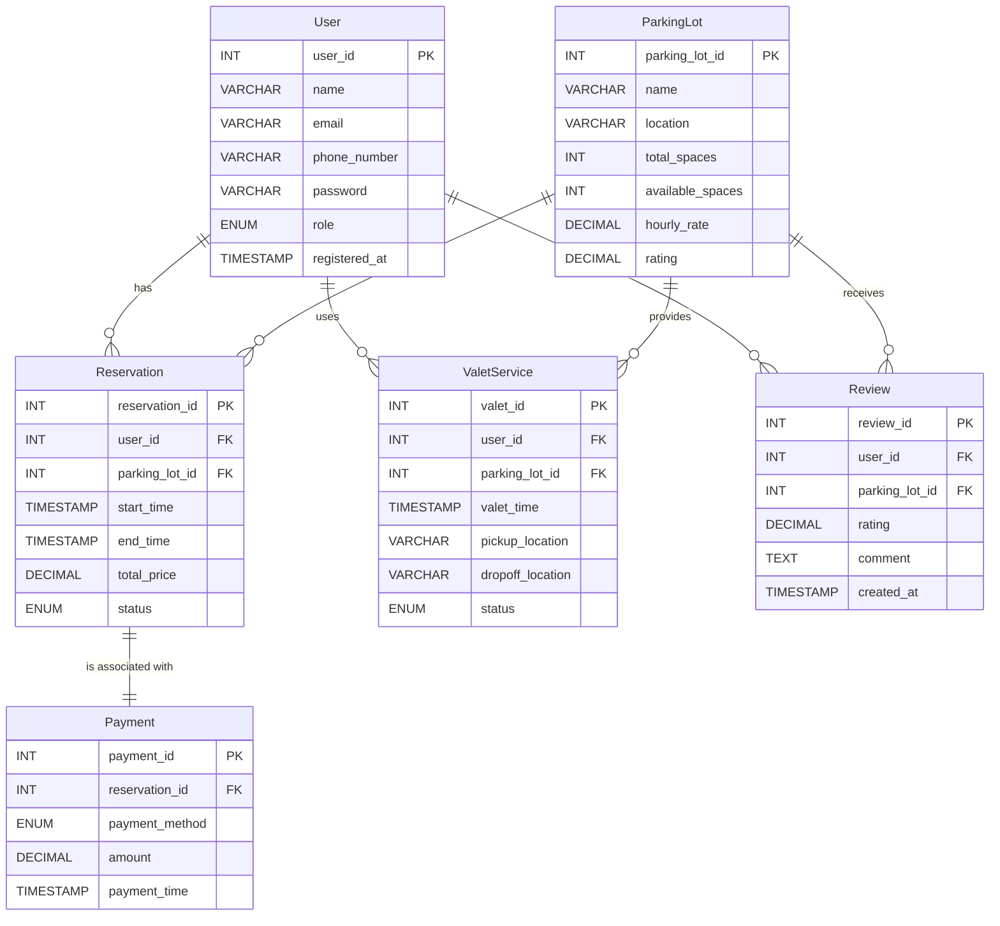
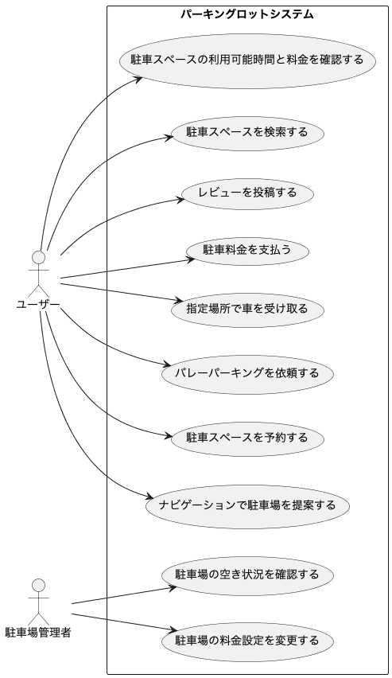
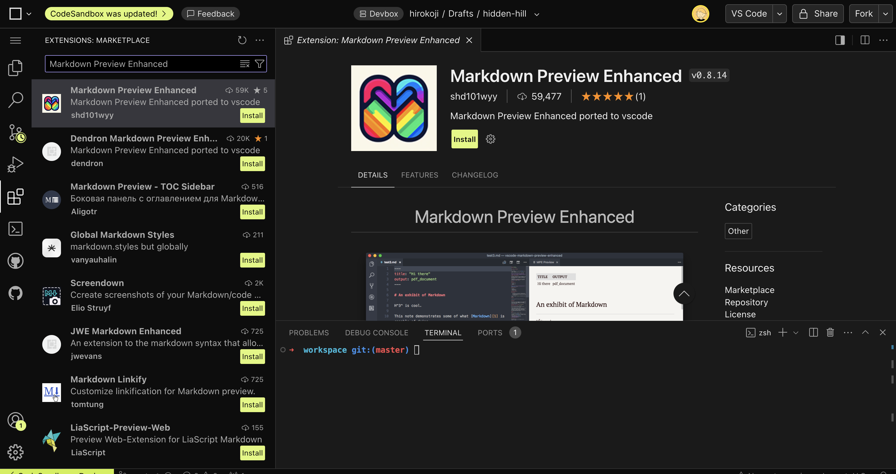
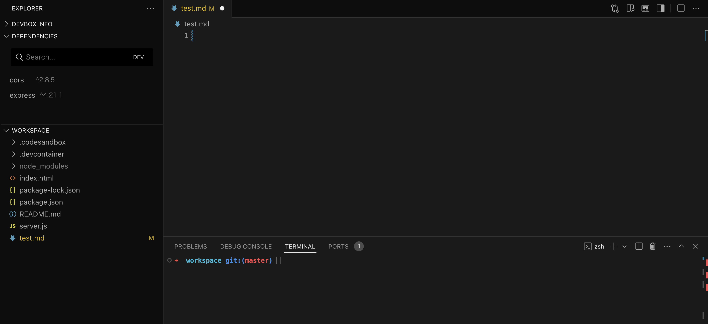
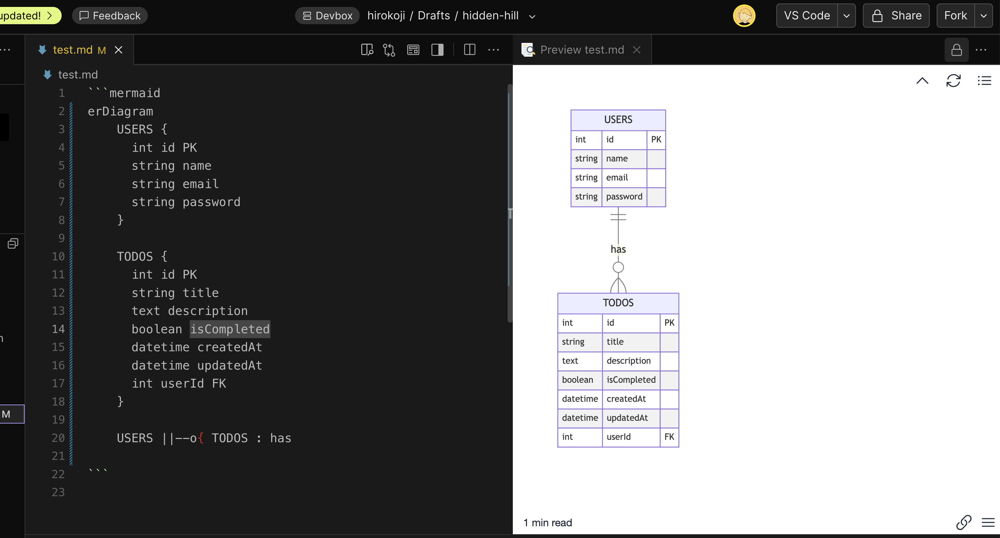
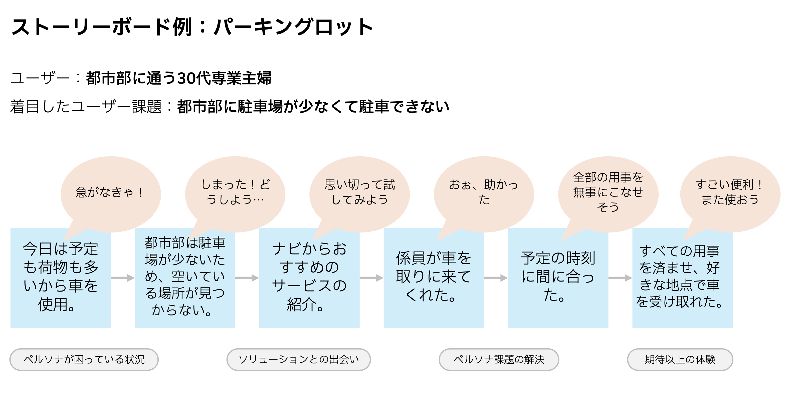

# ソリューションとテクノロジー ①設計編

[TOC]


## 3限目 ソリューション設計と要件定義

## 3.0 出欠登録 (5分)

## 3.1 目標と概要 (25分)

### 3.1.1 コース概要

このコースの前半7回は、ソフトウェアアーキテクチャの基本的な概念とデザイン思考の原則を組み合わせることで、実践的なソリューションスキルを身につけさせることを目的とします。具体的なケーススタディを通して、理論と実践の両方を深く理解し、実世界の問題解決に応用できる能力を養います。    

| 回数     |         1          |               2               |               3               |                 **4**                 |                 5                 |                   6                   |                 7                 |        8-14         |
| -------- | :----------------: | :---------------------------: | :---------------------------: | :-----------------------------------: | :-------------------------------: | :-----------------------------------: | :-------------------------------: | :-----------------: |
| テーマ   | ソリューション基礎 | ソリューションとデザイン思考① | ソリューションとデザイン思考② | **ソリューションとテクノロジー①設計** | ソリューションとテクノロジー②開発 | ケーススタディ①ソリューションデザイン | ケーススタディ②ソリューション開発 |    Creative Hack    |
| 担当講師 |     小島、竹田     |             竹田              |             竹田              |               **小島**                |               小島                |              小島、竹田               |            小島、竹田             |     伊藤、小島      |
| 場所     |     オンサイト     |          オンサイト           |           リモート            |            **オンサイト**             |             リモート              |               リモート                |            オンサイト             | オンサイト/リモート |


### 3.1.2 今日のゴール

- #### **ソリューションにおける要件定義の重要性を理解する**

- #### ソリューションにおけるアーキテクチャ設計の重要性を理解する

- #### 抽象(アーキテクチャ、モデル等の図)と具象(プログラム等の実態)とを行き来することの重要性を理解する


なぜ、以下のような図を書くことが重要か? 腹落ちできるか? 
わからないことがあれば、どんどん質問してください。(私にきいても、AIにきいてもおｋ)


<div style="text-align: center;">  2022年のアーキテクチャ<a href="https://engineering.mercari.com/blog/entry/20220830-15d4e8480e/"> [メルカリWebのマイクロサービス化、その4年より]</a> </div>


<div style="text-align: center;">    <a href="https://www.hitachiconsulting.co.jp/column/dx_era/01/index.html">引用: SoRシステムのアーキテクチャ例  (DX時代のITアーキテクチャとグランドデザインによる展開)
</a> </div>


### 3.1.3 本講義の位置づけ

前回まではデザインの視点で問題やアイディア(解決策)を考えてきました。
**今日から2日間(4回、5回)は<u>テクノロジーの観点で授業</u>を進めます。**


第4回は要件定義-設計、第5回は設計-開発に焦点をあてて授業を進めます。



1. **要件定義(Requirements):** ユーザーやクライアントの要求を把握し、必要な機能や仕様を定義します。
2. **設計(Design): **要件を基に設計を行います。基本設計や詳細設計などを含みます。
3. **開発(Develop)**: 設計されたシステムやソフトウェアを実際にコーディングして作成します。
4. **テスト(Test)**: 作成されたシステムをテストし、問題やバグがないか確認します。
5. **展開(Deploy)**: テストを通過したシステムを実際の運用環境に導入します。
6. **保守(Maintenance)**: システムが導入された後、運用中に発生する問題に対応し、必要に応じて改善や修正を行います。


これらの知識はアジャイル開発でも、ウォーターフォールでも用いることができます。
ウォーターフォールの方が要件定義と設計を詳細に行う傾向があります。


<div style="text-align: center;">    <a href="https://www.linkedin.com/pulse/waterfall-vs-agile-which-better-you-why-datacademy-cloud">引用: Waterfall Vs Agile: Which is better for You and Why?
</a> </div>


### 3.1.4 前提の把握 (5分) 

みなさんが知っていることを教えてください。今後の講義で解説すべき箇所を理解するために用います。

#### 1. プログラミング言語について

> [!Note]
>
> プログラミング言語の使用経験を教えてください。
> 以下の選択肢の中でやったことがあること全てを選択してください。
>
> ```
> :one: HTML/CSSを使ったことがある
> :two: JavaScriptを使ったことがある
> :three: 上記以外のプログラミング言語なら使ったことがある (Threadで触ったことがある言語を教えてください)
> :four: ない
> ```

#### 2. プログラミング経験について

> [!Note]
>
> プログラミング経験を教えてください。
> 以下の選択肢の中でやったことがあること全てを選択してください。
>
> ```
> :one: 関数を定義したことがある
> :two: クラスを定義したことがある
> :three: フレームワークを活用して開発したことがある (Threadで触ったことがあるフレームワークを教えてください)
> :four: 上記のことは知らないが、プログラムを動かしたことはある
> ```

#### 3. コンピューターサイエンスの基礎知識について

> [!Note]
>
> 以下の中で知っているテクノロジーはありますか? 
> 知っているテクノロジー全てにスタンプを押してください。
>
> ```
> :one: データベース(RDB, NoSQL等)を使ったことがある
> :two: プロトコルやネットワーク(HTTPS, DNS等)について学んだことがある
> :three: コンテナやVM(仮想マシン)について学んだことがある
> :four: バージョンコントロール(Git、Subversion等)について学んだことがある
> :five: 何それ?おいしいの?
> ```

### 3.1.5 開発環境セットアップ (15分)

1. **公式サイトにアクセス**

   - Webブラウザで[CodeSandbox](https://codesandbox.io/)の公式サイトにアクセスします。

2. **Sign Upボタンをクリック**

   - 画面右上にある「Sign In」ボタンをクリックしても新規アカウントの作成します。

3. **Googleアカウントでのサインアップ**

   - 表示されたサインアップページで「Continue with Google」を選択します。
   - Googleアカウントにサインインするよう求められるため、Googleのログイン情報を入力します。

4. **アカウント作成**

   - Username等を設定します。

     

   - NameSpaceは本講義とわかるように`genai-lecture`を設定します。

     

   - Freeプランを選択します。
     <strong><span style="color: red;">※Freeプランは40時間が上限になります。</span></strong>

     


1. **新規アカウントの作成完了**

   - 許可後、CodeSandboxのダッシュボード画面にリダイレクトされます。

     

2. **プロジェクトの作成**

   - 画面右上の「+Create」ボタンをクリックし、新しいプロジェクトを作成します。

   - プロジェクト名は`Solution-Design-Lecture-4`としてください。

   - テンプレートから`Docker`を選択します。
     

   - 以下のように表示できれば正常にプロジェクトを作成できています。

     

#### 3.3.2.1 動作確認してみよう

> [!NOTE]
>
> **JavaScript(Node.js)でHello Worldを出力してみよう。**
>
> 1. 新しいTERMINALタブを開く。
>
> 2. JavaScript(Node.js)をインストール
>
>    ```shell
>      apt install nodejs npm -y
>    ```
>
> 3. index.jsを作成
>
>    ```javascript
>    console.log("Hello, World!");
>    ```
>
> 4. Terminalからプログラムの実行
>
>    ```
>    node index.js
>    ```


## 3.2 要件定義 (50分)

### 3.2.1. **要件定義の基本概念**

#### **要件定義とは何か**

要件定義とは、プロジェクトの目的とスコープを明確にするためのプロセスです。これは、ビジネスの目標を達成するために必要な機能や制約を定義するもので、プロジェクトの設計、開発、導入に至るまでの指針となります。

#### **要件定義のプロセス**

1. 情報収集
   - ユーザーインタビュー: ユーザーのニーズや課題を理解するためのインタビューを実施
     - 例: ターゲットユーザーに「現在の課題は何ですか？」などの質問を行い、具体的なニーズを引き出す
   - 観察: ユーザーの行動を観察し、潜在的なニーズや問題を特定
2. ニーズの分析と整理
   - ペルソナの活用: 収集した情報を基にペルソナのニーズを整理し、主要な課題を特定
   - ユーザージャーニーの作成: ユーザーがサービスを利用する際の流れを明確にし、各段階でのニーズを把握
3. **要件定義**
   - **機能要件の定義**: 各ペルソナのニーズに基づいて必要な機能をリストアップ
   - **非機能要件の定義**: パフォーマンスやセキュリティ、使いやすさなど、システムに求められる品質を定義


### 3.2.2 要求分析の成果物

要求分析で作成する成果物の例を以下に示します。
何を成果物とするかは市場、ユーザー要求、チームの開発方針により異なりますが、
ソリューションを開発するために重要となる機能、UI、データを明確化ために作成するものです。

#### 1. ユーザーストーリーマップ [機能] <アジャイル>

**概要**：ユーザーストーリーマップは、ユーザーの行動やニーズに基づいて、製品開発に必要な機能やステップを整理し、全体の流れを視覚化したマップです。ユーザーが特定のゴールに到達するためにどのようなアクションを取るかを理解し、各アクションがどの機能に対応するかを明確にします。

**内容**：

- ユーザーの目標達成のためのステージ（例：「検索」「予約」「支払い」など）
- 各ステージにおけるユーザーアクション（例：「駐車場を検索」「駐車場を予約」など）
- ステージごとに対応するユーザーストーリー(機能やタスク)

**役割**：ユーザーストーリーマップは、ユーザーの行動やニーズに基づいてシステムの機能を整理し、開発チームが優先順位をつけて開発を進めるための基盤を提供します。これにより、開発チームはプロジェクト全体の流れを把握しやすくなり、ステークホルダーとの認識の共有や開発プロセスの効率化が図られます。


<div style="text-align: center;">    <a href="https://www.intellilink.co.jp/column/agile-devops/2021/091500.aspx">引用: チーム開発の視点が変わる アジャイル開発の新常識　第4回 初めての新規サービス開発（実践編）
</a> </div>

#### 2. モックアップ [UI] <アジャイル/ウォーターフォール>

**概要**：モックアップは、システムやアプリケーションのユーザーインターフェースを視覚的に表現した高精度なデザインプロトタイプです。色やフォント、レイアウト、UIコンポーネントを具体的にデザインし、最終製品に近い見た目を表現します。

**内容**：

- 色、フォント、レイアウト、グラフィックなど、ビジュアルデザインが反映された画面デザイン
- 各画面のUI要素（ボタン、フォーム、アイコンなど）の詳細なデザイン
- ユーザーインターフェースの全体的な見た目と操作感を表現

**役割**：モックアップは、ユーザーインターフェースのデザインを視覚的に確認し、ステークホルダーや開発チームとの認識の一致を図るために利用されます。最終製品のビジュアルを具体的に示すことで、デザインの方向性やユーザー体験に対するフィードバックを得ることができます。また、デザイナーや開発者が実際のUI/UX設計に進む前の調整段階として重要な役割を果たします。


<div style="text-align: center;">    <a href="https://moqups.com/blog/wireframe-vs-mockup-vs-prototype/">引用: Wireframe vs Mockup vs Prototype: What’s the difference?

</a> </div>

#### 3. データモデル [データ] <アジャイル/ウォーターフォール>

**概要**：データベースの設計図やデータモデルは、システム内のデータ構造やデータ間の関係を定義したものです。

**内容**：

- エンティティとその属性
- 各エンティティ間の関係（ER図など）
- データの正規化やキー制約の定義

**役割**：データモデルは、データベース設計と実装のガイドとして機能し、システム全体のデータフローを明確にします。

**例**：パーキングロットのデータモデル




#### 4. ユースケース図 [機能] <ウォーターフォール>

**概要**：ユースケース図は、システムとユーザーのやり取りを視覚的に表現したものです。ユースケース記述は、そのやり取りの詳細を記載したテキストです。

**内容**：

- システムの中でユーザーがどのような操作を行うか（ユースケースの列挙）
- ユーザー（アクター）とシステムの相互作用のフロー
- 正常系の動作やエラーハンドリングの説明

**役割**：ユースケースは、開発チームがシステムの振る舞いを正確に理解し、設計に反映させるためのガイドラインとして機能します。

**例**：パーキングロットのユースケース



#### 5. 要件定義書 [機能+] <ウォーターフォール>

**概要**：要件定義書は、ソフトウェアの機能要件や非機能要件をまとめた公式な文書です。これはプロジェクト全体の進行をガイドし、開発チームやステークホルダーがシステムに対して持つ共通の理解を形成するものです。

**内容**：

- 機能要件（例：ユーザーが行える操作やシステムの具体的な機能）
- 非機能要件（例：パフォーマンス、セキュリティ、スケーラビリティの要件）
- 制約条件（例：技術的制約、予算、スケジュール）

**役割**：このドキュメントは、開発、設計、テストの基準として機能します。

**例**：パーキングロット

| **項目**               | **内容**                                                     |
| ---------------------- | ------------------------------------------------------------ |
| **プロジェクト概要**   | **目的**: ユーザーが駐車場をスムーズに利用し、管理者が効率的に運用できるシステムの構築 <br>**対象ユーザー**: 一般ユーザー、駐車場管理者 |
| **機能要件**           | **ユーザーの機能**:<br> - 駐車スペースを検索する (UC1)<br> - 駐車スペースの利用可能時間と料金を確認する (UC2)<br> - ナビゲーションで駐車場を提案する (UC3)<br> - 駐車スペースを予約する (UC4)<br> - バレーパーキングを依頼する (UC5)<br> - 指定場所で車を受け取る (UC6)<br> - 駐車料金を支払う (UC7)<br> - レビューを投稿する (UC10) <br><br>**駐車場管理者の機能**:<br> - 駐車場の空き状況を確認する (UC8)<br> - 駐車場の料金設定を変更する (UC9) |
| **非機能要件**         | **パフォーマンス**: 同時1,000アクセス対応、迅速な駐車場検索と支払い処理<br>**セキュリティ**: SSL暗号化、GDPR準拠<br>**可用性**: 24時間365日稼働、99.9%稼働率<br>**レスポンシブデザイン**: すべてのデバイスで利用可能 |
| **ユーザーストーリー** | **一般ユーザーとして**:<br> - 駐車スペースを事前に予約して確実に駐車できるようにしたい<br> - 駐車場の空き状況をリアルタイムで確認し、到着前に適切な場所を見つけたい <br><br> **駐車場管理者として**:<br> - 駐車場の空き状況をリアルタイムで把握し、適切に管理したい<br> - 料金設定を柔軟に調整して、利用率を最大化したい |
| **制約条件**           | **予算**: 500万円以内 <br>**スケジュール**: 6ヶ月以内にリリース <br>**技術スタック**: フロントエンドはReact、バックエンドはNode.js、データベースはMySQL、インフラはAWS |
| **リスク管理**         | **技術的リスク**: 大規模アクセス時のパフォーマンス低下、負荷テストを実施 <br>**スケジュールリスク**: 要件変更による遅延、アジャイル開発で優先順位を管理 |


### 3.2.3 要望、要求、要件の違い

#### 1. **要望**

- **意味**: 要望は、ステークホルダー（顧客、ユーザー、経営層など）が「こうあればよい」と望むことです。必ずしも実現しなければならないものではなく、希望や期待に近いものです。
- 特徴
  - 非常に広範であり、実現可能かどうかは別として「理想的な状態」を指します。
  - プロジェクトの初期段階やヒアリング時に出てくることが多い。
  - 具体的な技術や実装方法を含まないことが多く、漠然とした表現が使われることがあります。
- **例**: 「ユーザーがもっと簡単に操作できるようにしたい」「新しい機能で業務が楽になればいい」

#### 2. **要求**

- **意味**: 要求は、要望をさらに具体的にしたもので、ステークホルダーが「必ず実現してほしい」と望むことです。プロジェクトにおいて外せない条件や基準に近く、実現が必須とされる内容です。
- **特徴**:
  - ビジネス的な必要性に基づいており、達成されないとプロジェクトの成功が危ぶまれるような重要な要素です。
  - 実現可能性を考慮した具体的な項目が多いが、まだ技術的な詳細は含まれていない。
  - 要件定義の基盤となるが、全てがシステム要件として落とし込まれるわけではない。
- **例**: 「システムは1日24時間稼働している必要がある」「データは暗号化して保存されなければならない」

#### 3. **要件**

- **意味**: 要件は、要求を基にした具体的で明確なシステムやプロセスに関する条件です。要件は、システムやソリューションがどのように機能するか、どのようにして要求を満たすかを定義したものです。
- **特徴**:
  - 明確で測定可能な形で記述されており、具体的な実装や技術的な仕様が含まれます。
  - 要件は、システムの設計、開発、テストの基準となり、満たすべき条件として扱われます。
  - 機能要件（システムの機能に関する要件）や非機能要件（性能、セキュリティ、拡張性などの品質に関する要件）が含まれます。
- **例**: 「ユーザーが1秒以内に検索結果を得られる」「システムは5000ユーザーの同時アクセスをサポートする」「顧客データはAES-256暗号化を使用して保存される」

### 3.2.4 やってみよう: 要件定義におけるAIの活用 (10分)

> [!Note]
>
> **生成AIを活用してER図を書いてみよう。**
>
> 1. CodeSandboxを起動
>
> 2. CodeSandboxでExtenstionから`Markdown Preview Enhanced`をインストール
>
>    
>
> 3. CodeSandboxで`test.md`を作成する
>
>    
>
> 4. 生成AI(ChatGPT等)でER図を作成する。
>    プロンプト: [.](https://chatgpt.com/share/670c7ac5-697c-8004-9440-89e80d0711f2)
>
>    ```
>    ToDoアプリを作成しようと思っています。
>    markdownのmermaidでER図を作成してださい。
>    ```
>
> 5. test.mdにコピペし、プレビューをクリック。
>
>    


### 3.2.5 演習3-1: ユーザーストーリマップ (30分)

> [!Note]
>
> **ユーザーストーリーマップを書いてみよう**
>
> [前回のストーリーボード](https://app.mural.co/t/solutiondesignwithtechnology3436/m/solutiondesignwithtechnology3436/1725495370062/9994a1834cc9656c15b61b0cc8db844e6a9c2ffc?sender=u979a607afbfba3c8be1a2063)をベースにユーザーストーリーマップを書いてみよう。
>
> [ここのMuralに](https://app.mural.co/t/solutiondesignwithtechnology3436/m/solutiondesignwithtechnology3436/1726565078531/51ddadfd249c8900e383271abe6e163322ad249f?wid=0-1729040737760)ユーザーストーリーマップを書こう。
>
> 


## 4限目 ソリューション設計とアーキテクチャ

## 4.1 コンピューター基礎 (60分)

設計を行うために最低限必要なコンピューター基礎の知識をインプットします。
気になる箇所は生成AIに質問したり、本や動画等を活用し、深く学んでみてください。

### 4.1.1 ソフトウェア基礎

#### **プログラミング**

プログラミングとは、コンピュータに指示を与えるための手順を記述することです。プログラミング言語を使って一連の命令をコードとして書き、コンピュータがその命令を実行することで、タスクや計算を自動化したり、アプリケーションを動作させたりします。プログラミングは、ソフトウェア開発の根本であり、コンピュータに「何をするか」を教える行為です。

- 例: 簡単な「Hello, World!」プログラム

  ```javascript
  console.log("Hello, World!");
  ```

#### **関数**

関数は、特定のタスクや計算を行うコードのまとまりです。関数は再利用可能で、複雑な処理を簡潔にまとめ、必要なときに何度でも呼び出して使用することができます。引数を受け取って処理し、結果を返すことが一般的です。

- 例: 2つの数字を足す関数。

  ```javascript
  function addNumbers(a, b) {
      return a + b;
  }
  console.log(addNumbers(3, 5));  // 8
  ```

#### **クラス**

クラスは、オブジェクト指向プログラミングの概念で、データとそのデータを操作する関数（メソッド）をまとめたものです。クラスは、関連するデータとその操作を一緒に扱うことで、複雑なシステムを構造化しやすくします。クラスから生成された具体的なインスタンスがオブジェクトです。

- 例: 人間を表すクラス。

  ```javascript
  class Person {
      constructor(name, age) {
          this.name = name;
          this.age = age;
      }
  
      greet() {
          return `Hello, my name is ${this.name}.`;
      }
  }
  
  const person = new Person('Alice', 30);
  console.log(person.greet());  // "Hello, my name is Alice."
  ```

#### **ライブラリ**

ライブラリとは、特定のタスクを行うために、あらかじめ作成された関数やクラスの集合体です。ライブラリを使うことで、開発者は基本的な機能やアルゴリズムを自分で一から書く必要がなく、既存のコードを簡単に再利用することができます。プログラムの効率や開発速度を大幅に向上させるために使われます。

- 例: 「mathjs」ライブラリを使って平方根を計算する。

  ```shell
  npm install mathjs
  ```

  ```javascript
  const math = require('mathjs');
  console.log(math.sqrt(16));  // 4
  ```

#### **コンポーネント**

コンポーネントは、ソフトウェア開発における再利用可能な部品であり、特にフロントエンド開発やモジュール化されたシステムで使われます。コンポーネントは、特定の機能やUI要素をカプセル化して管理し、他の部分と独立して動作するよう設計されています。これにより、開発者はソフトウェアを柔軟に組み合わせて、複雑なシステムを効率的に構築できます。

- 例: モジュールとして関数をエクスポートし、他のファイルで使用

mathFunction.js

```javascript
function add(a, b) {
    return a + b;
}
module.exports = { add };
```

index.js

```javascript
const { add } = require('./mathFunctions');
console.log(add(3, 5));  // 8
```

> [!Note]
>
> **コードが動くか確かめてみよう。**
>
> ソフトウェア基礎の中で知らなかったこと、気になることを1つ選びをCodeSandboxで実行してみよう。
>
> 

### 4.1.2 ネットワーク基礎

ネットワークの基礎もアーキテクチャの理解に不可欠な要素です。以下は、ネットワークの基本概念になります。

#### **ネットワーク**

ネットワークは、コンピュータやデバイスが相互に接続され、データをやり取りできる仕組みです。インターネットは世界中のネットワークが集まった巨大なネットワークであり、これによりウェブサイトの閲覧や電子メールの送受信が可能になります。

#### **IPアドレス**

IPアドレスは、ネットワーク上のデバイスを識別するための一意の番号です。これにより、デバイス間でのデータの送受信が可能になります。

- **IPv4**: 4つの数字（例: `192.168.1.1`）で表され、32ビットのアドレス空間です。
- **IPv6**: 8つのセグメント（例: `2001:0db8:85a3:0000:0000:8a2e:0370:7334`）で表され、128ビットのアドレス空間を提供します。

#### **DNS（Domain Name System）**

DNSは、ドメイン名（例: `example.com`）をIPアドレスに変換する仕組みです。これにより、ユーザーは覚えやすい名前でウェブサイトにアクセスでき、コンピュータはその名前をIPアドレスに変換して接続先を特定します。

- **例**: `www.google.com` -> `142.250.190.14`（IPアドレス）

#### **HTTP/HTTPS**

HTTP（Hypertext Transfer Protocol）は、ウェブ上でデータをやり取りするためのプロトコルです。ブラウザがウェブサーバーからデータを取得し、ウェブページを表示するために使用されます。

- **HTTP**: 暗号化されていない通信。
- **HTTPS**: SSL/TLSにより暗号化された通信。データの送受信が安全になります。

> [!Note]
>
> **WebページのIPと所在地を確認してみよう。**
>
> 一緒に[マサチューセッツ造形芸術大学ホームページ](https://massart.edu/)([学生交流協定締結校](https://www.kyoto-art.ac.jp/info/partner-institutions/))のIPを調べてみよう。
> そのIPがどこに場所に存在しているか確認してみよう。
>
> 1. digコマンドのインストール
>
> ```
> apt install dnsutils -y
> ```
>
> 2. IPを調べる
>
> ```
> > dig massart.edu
> ```
>
> 3. IPの場所を調べる
>    [WhatIsMyIPAddress](https://whatismyipaddress.com/ip-lookup)でそのIPがどこに存在しているか確認してみよう。


> [!Note]
>
> 一人で[京都芸術大学ホームページ](https://www.kyoto-art.ac.jp/)のIPとどこの場所に存在しているか確認してみよう。
>
> 
>
> ```
> 京都外術大学ホームページのIP: x.x.x.x
> IPの場所:
> ```


### 4.1.3 データベース基礎 

#### **データベースとは？**

データベースは、情報（データ）を整理して保存し、必要に応じて効率よく検索・操作できるようにするシステムです。データベース管理システム（DBMS）は、このデータベースを管理するソフトウェアです。代表的なDBMSには、MySQL、PostgreSQL、SQLite、Oracleなどがあります。

#### **リレーショナルデータベース（RDBMS）**

リレーショナルデータベースは、テーブル（表）形式でデータを保存し、データ間の関係（リレーション）を利用して情報を整理します。テーブルには行（レコード）と列（フィールド、カラム）があり、それぞれが1つのデータ項目を表します。

- 例: 顧客テーブル（customers）

  | ID   | 名前     | メール             |
  | ---- | -------- | ------------------ |
  | 1    | 山田太郎 | yamada@example.com |
  | 2    | 佐藤花子 | sato@example.com   |

データベースの基礎を復習することで、アーキテクチャ設計やシステム開発でデータの管理・操作に関する知識を深めることができます。以下は、大学生向けに最低限理解しておくべきデータベースの基礎事項です。

#### **SQL（Structured Query Language）**
SQLは、データベースを操作するための標準言語です。SQLを使用して、データの作成、読み取り、更新、削除（CRUD操作）を行います。

- **SELECT**: データの読み取り（検索）。
  ```sql
  SELECT * FROM customers;
  ```

- **INSERT**: データの挿入。
  ```sql
  INSERT INTO customers (名前, メール) VALUES ('鈴木次郎', 'suzuki@example.com');
  ```

- **UPDATE**: データの更新。
  
  ```sql
  UPDATE customers SET メール = 'newemail@example.com' WHERE ID = 1;
  ```
  
- **DELETE**: データの削除。
  
  ```sql
  DELETE FROM customers WHERE ID = 2;
  ```

### **NoSQLデータベース**
リレーショナルデータベースに対して、NoSQLデータベースは、スキーマを持たない、あるいは柔軟なスキーマを持つデータベースです。主に大規模なデータや非構造化データを扱うために使われます。代表的なNoSQLデータベースには、MongoDB、Cassandra、Redisなどがあります。

- **ドキュメント指向データベース**: MongoDBのように、JSON形式のドキュメントでデータを保存します。
- **キー・バリューストア**: RedisやDynamoDBのように、キーと値のペアでデータを保存します。

```
[
  {
    "ID": 1,
    "名前": "山田太郎",
    "メール": "yamada@example.com"
  },
  {
    "ID": 2,
    "名前": "佐藤花子",
    "メール": "sato@example.com"
  }
]
```


> [!Note]
>
> **PostgreSQL(RDB)を触ってみよう**
>
> - postgreSQLデータベースのインストール (以下は全てTerminalで実行)
>
> ```
> # postgreSQLのインストール
> apt install -y postgresql
> # postgreSQLの起動
> service postgresql start
> # postgresユーザーとしてログイン
> sudo -i -u postgres
> # postgreSQLに接続
> psql
> ```
>
> - SQLの実行
>
>   - テーブルの作成
>
>     ````
>     CREATE TABLE customers (
>         id SERIAL PRIMARY KEY,
>         名前 VARCHAR(100),
>         メール VARCHAR(100)
>     );
>     ````
>
>   - データの読み取り
>
>   - データの挿入
>
> - 上記作業が終わったら、rootユーザーに戻りましょう
>   ```
>   postgres=# exit
>   postgres@ghghvf:~$ exit
>   ➜  workspace git:(master) whoami
>   root
>   ```
>


### 4.3.4 セキュリティ基礎

#####  **認証と認可**

- **認証（Authentication）**: ユーザーやサービスの身元確認を行います。アーキテクチャ設計では、どの認証方式を選ぶかが重要です。OAuthやOpenID Connectなどの標準プロトコルを使用して、安全な認証を設計します。
- **認可（Authorization）**: 認証されたユーザーが何を操作できるかを決定するプロセスです。Role-Based Access Control（RBAC）やAttribute-Based Access Control（ABAC）など、認可方式の選定がアーキテクチャ設計に含まれます。

##### **ネットワークセキュリティ**

- **ファイアウォール**: 不正なアクセスを防ぐためのネットワーク上のフィルタリングシステム。特定のIPアドレスやポート番号に基づいてアクセス制御を行い、許可された通信のみを通過させます。
- **VPN（Virtual Private Network）**: VPNを使用することで、インターネット上で暗号化されたプライベートな通信を実現できます。これにより、安全なリモートアクセスや、外部からの盗聴を防ぎます。

 . **セキュリティ境界の設計**

- **セキュリティ境界（Security Perimeter）**: アーキテクチャの中で、どの部分を外部アクセスから保護するかを決める境界設計です。重要な部分にはファイアウォール、APIゲートウェイ、リバースプロキシを配置して、不正なアクセスを防ぎます。
- **ゼロトラストアーキテクチャ**: すべてのアクセスを検証する考え方で、内部ネットワークでも信頼せず、リソースへのアクセスには常に認証を要求するモデルです。


## 4.2 ソリューション設計とアーキテクチャ

### 4.2.1 アーキテクチャ

#### アーキテクチャとは

アーキテクチャとは、ソフトウェアやシステムの全体的な構造を定義するプロセスのことです。建物の設計図と同じように、アーキテクチャはどのようにシステムが構築され、各部分がどのように連携して動作するかを決定します。アーキテクチャは、システムの基本的な構造や、使う技術、コンポーネント間のつながりを定めることで、プロジェクトの成功に直結します。


<div style="text-align: center;">    <a href="https://www.global.toshiba/jp/company/digitalsolution/articles/tsoul/28/003.html">引用: マイクロサービスアーキテクチャの進化と適用事例
</a> </div>

#### **ソフトウェアアーキテクチャの役割**

アーキテクチャは、システム全体を俯瞰し、開発チーム全員が同じ方向に向かって開発できるようにします。設計図がなければ、家は作れません。それと同じで、アーキテクチャがないと、ソフトウェアはバラバラのものになりがちです。

#### **アーキテクチャの構成要素**

アーキテクチャは、主に以下の構成要素から成り立ちます：

- コンポーネント：システムの各部分
- データフロー：データがどのようにシステム内を流れるか
- インターフェース：コンポーネント間の通信方法
- 非機能要件：パフォーマンス、スケーラビリティ、セキュリティなど

### 4.2.2 アーキテクチャが重要な理由

アーキテクチャは、ソフトウェア開発の成功と失敗を分ける重要な要因です。なぜ重要なのか、具体的な理由を見ていきます。

##### ・策定したアイディアは実現できるのか?

開発者が考えた素晴らしいアイディアも、適切なアーキテクチャがなければ実現できません。たとえば、性能が求められるリアルタイム処理を実現したい場合、それに対応できる設計が必要です。アーキテクチャは、アイディアを実際のシステムに落とし込むためのガイドとなります

##### ・最短経路を走ろう

効率的にシステムを開発・運用するためには、無駄な作業や重複を避け、最短で目標を達成できるアーキテクチャを設計することが必要です。適切なアーキテクチャは、開発の無駄を省き、スムーズなリリースを実現します。

##### ・チームで開発することを見据えて

ソフトウェア開発は、通常1人ではなくチームで行います。そのため、複数人で作業する際にも役割分担ができ、各メンバーがスムーズに作業できるアーキテクチャが必要です。特に、大規模なプロジェクトでは、コンポーネント間の依存関係が明確で、インターフェースがしっかりと定義されていることが重要です。

### 4.2.3 アーキテクチャ策定方法

#### 4.2.3.1 アーキテクチャドライバ (重要な要素)の特定

アーキテクチャを策定する際には、まずシステムにおいて何が重要なのかを決める必要があります。これを「アーキテクチャドライバ」と呼びます。以下は典型的なアーキテクチャドライバの例です：

- **パフォーマンス**：システムがどの程度の速度で動作する必要があるか。
- **スケーラビリティ**：将来的な利用者の増加に対応できるか。
- **セキュリティ**：外部からの攻撃に対してシステムを守れるか。

これらの要素を特定することで、システムがどのような要件を満たす必要があるのかが明確になります。

#### 4.2.3.2 アーキテクチャ案の洗い出し

アーキテクチャドライバを特定した後、いくつかの異なるアーキテクチャ案を検討します。例えば、モノリシックなアーキテクチャか、マイクロサービスを採用するか、クラウドを利用するか、などです。

#### 4.2.3.3 アーキテクチャの決定

それぞれの案には、利点と欠点が存在します。そのため、これらを比較して最適な案を選定します。
以下にアーキテクチャを比較するための評価項目を示します。

- **セキュリティ的に問題ないか?**
  システムが不正アクセスや脆弱性に対して強固であるかを確認します。たとえば、暗号化やアクセス制御をどのように実装するかが重要です。
- **拡張性はあるか?**
  システムが将来の機能追加や変化に対応できる柔軟性を持っているか確認します。たとえば、初期段階では小規模なシステムであっても、将来的にユーザー数が増加した場合にも対応できるかを考慮します。
- **チームで開発できるか?**
  設計が大規模なチーム開発に対応しているか、役割分担がしやすいかを確認します。たとえば、モジュールごとに責任が明確で、インターフェースがしっかり定義されているかが重要です。

### 4.2.4 演習4-1: ToDoアプリ開発とアーキテクチャ設計 (ボトムアップ) (20分)

> [!Note]
>
> **ToDoアプリを開発後にアーキテクチャを書いてみよう。**
>
> 1. 生成AI(ChatGPT)等でアプリケーションのコードを生成する。
>    コードを生成するプロンプト:
>
>    ```
>    CodeSandboxのDevbox環境を使用して、ToDo Webアプリを開発したいです。
>    以下の条件に基づいたコードの生成をお願いできますか。
>    また、必要なライブラリのインストール手順とサーバーの実行手順も教えてください。
>    
>    条件:
>    - frontendはHTML, CSS, JavaScriptのみ、1つのファイルだけで表現する。
>    - frontendのファイル名はindex.html。index.htmlはルート直下に配置。
>    - backendはNode.js簡易なWeb APIを開発する。
>    - frontendもbackendと同じサーバーでレンダリングする。
>    - ToDo WebアプリではToDoの追加、削除、変更ができる
>    ```
>
>    うまくいかない人は[こちら](https://chatgpt.com/share/670c6dab-e8e4-8004-85c0-656d4375f37c)を参考にしてToDo Webアプリを開発する。
>
>    
>    
> 2. Muralに上記ToDoアプリのアーキテクチャを書いてみよう
>
> 3. アーキテクチャを書くためにわからないことは生成AI(ChatGPT)に聞いてみる。

### 4.5 4つの設計レベル

#### 1. **アーキテクチャ設計（Architecture Design）**

- **説明**: アーキテクチャ設計は、システム全体の構造を定義するプロセスです。システムをどのようなコンポーネントやサブシステムに分解し、それらがどのように相互作用するかを決定します。技術スタック、ネットワーク構成、データベースの選択、APIやインターフェースの設計といった、システム全体に関わる決定がここで行われます。
- **対象**: システム全体の構成、主要コンポーネント間の関係、技術的なインフラの選択
- **例**: クラウドベースの分散システム、3層アーキテクチャ（プレゼンテーション層、ビジネスロジック層、データ層）


#### 2. **モジュール設計（Module Design）**

- **説明**: モジュール設計では、システム全体を機能ごとのモジュールに分割し、各モジュールの役割とインターフェースを定義します。この段階では、システムの各部分がどのような機能を持つか、その機能がどのように他の部分とやりとりするかを考えます。ただし、まだ詳細なコードの設計までは踏み込んでいません。
- **対象**: システムを構成する各機能ブロック（モジュール）とそのインターフェース
- **例**: ユーザー管理モジュール、支払い処理モジュール、データベースアクセスモジュール

#### 3. **コンポーネント設計（Component Design）**

- **説明**: コンポーネント設計では、各モジュールの中でどのようなコンポーネントが必要かを定義します。コンポーネントは、具体的な機能を実現する小さなパーツで、再利用可能な単位として扱われます。この段階では、モジュール内の機能を細分化し、コードを書くための準備を進めます。各コンポーネントのインターフェースや依存関係もここで定義されます。
- **対象**: モジュール内の機能ブロック（コンポーネント）とそれらの相互作用
- **例**: ユーザーログインコンポーネント、商品検索コンポーネント、支払いゲートウェイコンポーネント

#### 4. **クラス設計（Class Design）**

- **説明**: クラス設計は、オブジェクト指向設計の中核であり、コンポーネントやモジュールを実装するための詳細な設計を行います。クラスは、特定の機能を持つオブジェクトの設計図であり、属性やメソッドが定義されます。この段階では、コードレベルでの具体的な設計が行われ、実装するためのクラスの構造や相互関係が決まります。
- **対象**: クラス、メソッド、プロパティ、インターフェース、継承関係などの詳細な設計
- **例**: `User` クラス、`PaymentProcessor` クラス、`Order` クラス


### 4.3.1 演習4-2: アーキテクチャ設計 (トップダウン) (20分)

> [!Note]
>
> Muralにユーザーストーリマップのアーキテクチャ設計をしてみよう。
>
> 


## 5. 参考文献

- [アーキテクトの教科書 価値を生むソフトウェアのアーキテクチャ構築](https://www.amazon.co.jp/%E3%82%A2%E3%83%BC%E3%82%AD%E3%83%86%E3%82%AF%E3%83%88%E3%81%AE%E6%95%99%E7%A7%91%E6%9B%B8-%E4%BE%A1%E5%80%A4%E3%82%92%E7%94%9F%E3%82%80%E3%82%BD%E3%83%95%E3%83%88%E3%82%A6%E3%82%A7%E3%82%A2%E3%81%AE%E3%82%A2%E3%83%BC%E3%82%AD%E3%83%86%E3%82%AF%E3%83%81%E3%83%A3%E6%A7%8B%E7%AF%89-%E7%B1%B3%E4%B9%85%E4%BF%9D-%E5%89%9B/dp/4798184772) 米久保 剛 (著)
- [ソフトウェアアーキテクチャの基礎 ―エンジニアリングに基づく体系的アプローチ](https://www.amazon.co.jp/%E3%82%BD%E3%83%95%E3%83%88%E3%82%A6%E3%82%A7%E3%82%A2%E3%82%A2%E3%83%BC%E3%82%AD%E3%83%86%E3%82%AF%E3%83%81%E3%83%A3%E3%81%AE%E5%9F%BA%E7%A4%8E-%E2%80%95%E3%82%A8%E3%83%B3%E3%82%B8%E3%83%8B%E3%82%A2%E3%83%AA%E3%83%B3%E3%82%B0%E3%81%AB%E5%9F%BA%E3%81%A5%E3%81%8F%E4%BD%93%E7%B3%BB%E7%9A%84%E3%82%A2%E3%83%97%E3%83%AD%E3%83%BC%E3%83%81-Mark-Richards/dp/4873119820/ref=asc_df_4873119820/?tag=jpgo-22&linkCode=df0&hvadid=707442440817&hvpos=&hvnetw=g&hvrand=4328300142511091535&hvpone=&hvptwo=&hvqmt=&hvdev=c&hvdvcmdl=&hvlocint=&hvlocphy=9198953&hvtargid=pla-1598909028629&psc=1&mcid=e4f9ad4d45b035db97728a91acdcd7bb&th=1&psc=1&gad_source=1)  Mark Richards (著), Neal Ford (著), 島田 浩二 (翻訳)
- [はじめよう! 要件定義 ~ビギナーからベテランまで](https://www.amazon.co.jp/%E3%81%AF%E3%81%98%E3%82%81%E3%82%88%E3%81%86-%E8%A6%81%E4%BB%B6%E5%AE%9A%E7%BE%A9-%E3%83%93%E3%82%AE%E3%83%8A%E3%83%BC%E3%81%8B%E3%82%89%E3%83%99%E3%83%86%E3%83%A9%E3%83%B3%E3%81%BE%E3%81%A7-%E7%BE%BD%E7%94%9F-%E7%AB%A0%E6%B4%8B/dp/4774172286/ref=sr_1_4?__mk_ja_JP=%E3%82%AB%E3%82%BF%E3%82%AB%E3%83%8A&crid=2JWUKBFIV5QCK&dib=eyJ2IjoiMSJ9.bZdiXi9Hb_gIhxbEeHcERNUvh3kFNPwgL0xXnEDr8yGP1R2q6LY59B46UaW3nknVKZQ56ilrHb5mHLr_Ie1OKFIFQ5DCyTaljXh7fhqOivSZSMQY4TRdRA1cjg1FOc3Nz9pkIPYiODZS4Hmhw4wOmq9uTPPRNgF6ZBrF3wFyeYwOK1C7cBg6D4xHlU08b6CGqg1-66Dh35rILCX-VkSPnBL-e0gV1BRsb2eQH1PE_o0.srpKID65hDiXKd7clf0nG-uKjA0TqJvcboSG_429g3s&dib_tag=se&keywords=%E8%A6%81%E4%BB%B6%E5%AE%9A%E7%BE%A9&qid=1729042584&s=books&sprefix=%E8%A6%81%E4%BB%B6%E5%AE%9A%E7%BE%A9%2Cstripbooks%2C155&sr=1-4) 羽生 章洋 (著)
- 
