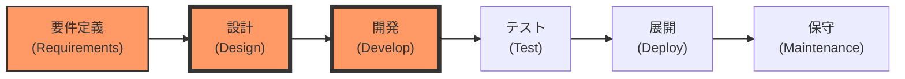
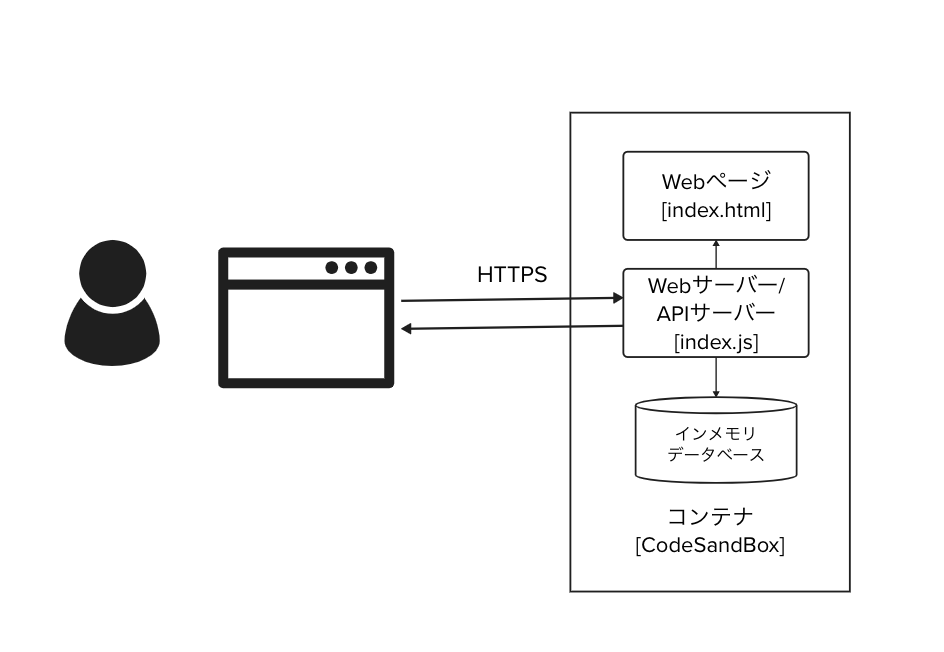
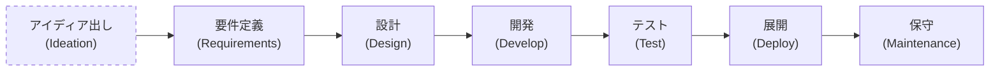
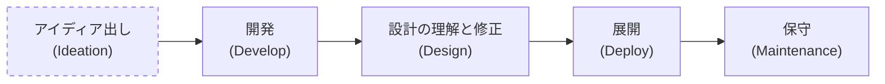
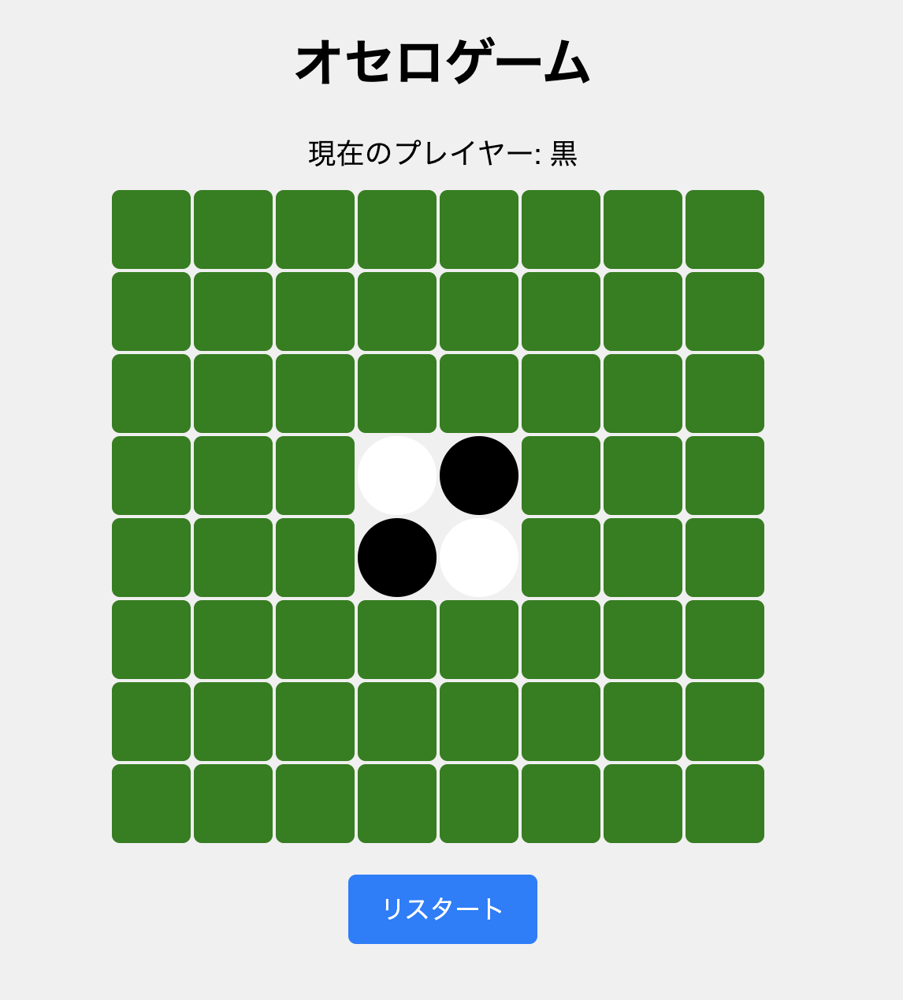
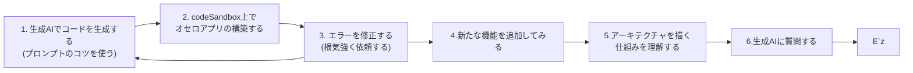
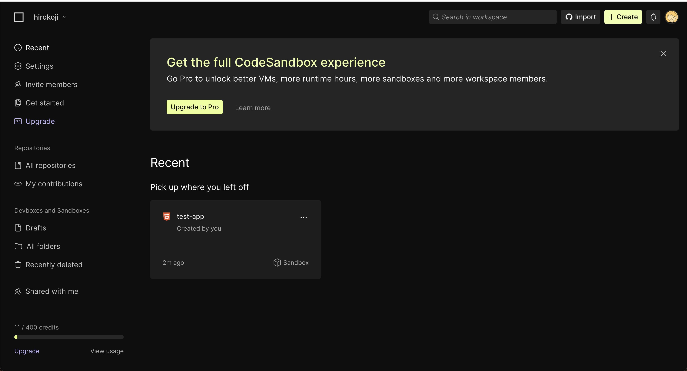
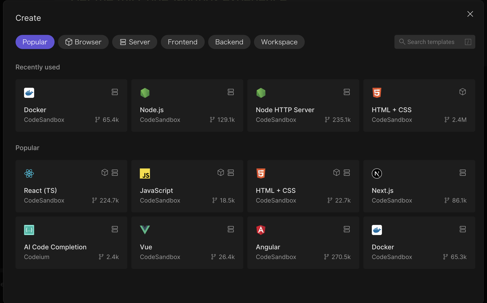
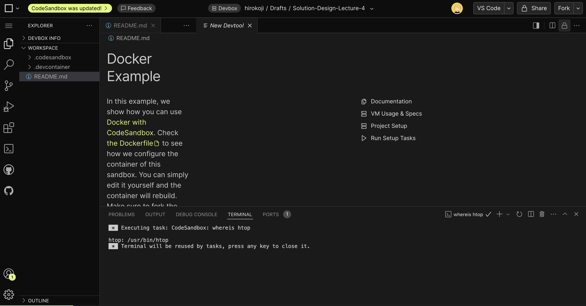

# ソリューションとテクノロジー ②開発編

[TOC]


## 3限目 ソリューション開発と生成AI

## 3.0 出欠登録 (5分)

## 3.1 目標と概要 (25分)

### 3.1.1 コース概要

このコースの前半7回は、ソフトウェアアーキテクチャの基本的な概念とデザイン思考の原則を組み合わせることで、実践的なソリューションスキルを身につけさせることを目的とします。具体的なケーススタディを通して、理論と実践の両方を深く理解し、実世界の問題解決に応用できる能力を養います。    

| 回数     |         1          |               2               |               3               |               **4**               |                   5                   |                   6                   |                 7                 |        8-14         |
| -------- | :----------------: | :---------------------------: | :---------------------------: | :-------------------------------: | :-----------------------------------: | :-----------------------------------: | :-------------------------------: | :-----------------: |
| テーマ   | ソリューション基礎 | ソリューションとデザイン思考① | ソリューションとデザイン思考② | ソリューションとテクノロジー①設計 | **ソリューションとテクノロジー②開発** | ケーススタディ①ソリューションデザイン | ケーススタディ②ソリューション開発 |    Creative Hack    |
| 担当講師 |     小島、竹田     |             竹田              |             竹田              |               小島                |               **小島**                |              小島、竹田               |            小島、竹田             |     伊藤、小島      |
| 場所     |     オンサイト     |          オンサイト           |           リモート            |            オンサイト             |             **リモート**              |               リモート                |            オンサイト             | オンサイト/リモート |


### 3.1.2 今日のゴール

- #### **アーキテクチャを更に深く理解する**

- #### AIを活用した開発手法を理解する


### 3.1.3 本講義の位置づけ

前回まではデザインの視点で問題やアイディア(解決策)を考えてきました。
**前回から<u>テクノロジーの観点で授業</u>を進めまています。**
今回は開発方法に特化して授業を進めます。


第4回は要件定義-設計、第5回は設計-開発に焦点をあてて授業を進めます。



1. **要件定義(Requirements):** ユーザーやクライアントの要求を把握し、必要な機能や仕様を定義します。
2. **設計(Design): **要件を基に設計を行います。基本設計や詳細設計などを含みます。
3. **開発(Develop)**: 設計されたシステムやソフトウェアを実際にコーディングして作成します。
4. **テスト(Test)**: 作成されたシステムをテストし、問題やバグがないか確認します。
5. **展開(Deploy)**: テストを通過したシステムを実際の運用環境に導入します。
6. **保守(Maintenance)**: システムが導入された後、運用中に発生する問題に対応し、必要に応じて改善や修正を行います。


これらの知識はアジャイル開発でも、ウォーターフォールでも用いることができます。
ウォーターフォールの方が要件定義と設計を詳細に行う傾向があります。


<div style="text-align: center;">    <a href="https://www.linkedin.com/pulse/waterfall-vs-agile-which-better-you-why-datacademy-cloud">引用: Waterfall Vs Agile: Which is better for You and Why?
</a> </div>


### 3.1.4 前回の復習 

- 要件定義とは
- アーキテクチャとは


### 3.1.5 開発したToDoアプリの構造を理解しよう (15分)

[前回開発したアプリケーション](https://github.com/Creative-Cucumbers/solution-design-with-technology/tree/main/2024/4_architecture_for_technology_solution_1#424-%E6%BC%94%E7%BF%924-1-todo%E3%82%A2%E3%83%97%E3%83%AA%E9%96%8B%E7%99%BA%E3%81%A8%E3%82%A2%E3%83%BC%E3%82%AD%E3%83%86%E3%82%AF%E3%83%81%E3%83%A3%E8%A8%AD%E8%A8%88-%E3%83%9C%E3%83%88%E3%83%A0%E3%82%A2%E3%83%83%E3%83%97-20%E5%88%86)の構造を理解してみましょう。

理解できた方はこれが良いアーキテクチャか?を考えてみましょう。



#### 3.1.5.1 **Webサーバーとは？**

Webサーバーとは、**インターネットを通じてWebページやデータを提供するコンピュータやソフトウェア**のことです。ユーザーがWebサイトにアクセスすると、そのリクエストを受け取り、HTML、画像、動画などのデータを返す役割を担います。

##### **役割**

- **ファイルの提供**: HTMLや画像、CSS、JavaScriptなどのファイルをユーザーに配信。

- **リクエストの処理**: ユーザーからのリクエストを解析して、適切なデータを返す。

- **動的コンテンツの生成**: ユーザーの操作に応じて、リアルタイムでWebページを生成することもできる。

  

#### 3.1.5.2 Web APIとは何か?

Web APIとは、インターネットを介して利用できるAPIのことです。
API（Application Programming Interface）は、異なるソフトウェアやシステムが相互にやり取りをするための「ルール」や「窓口」の役割を果たします。
APIを使うことで、他のアプリやサービスの機能を自分のアプリに組み込むことができます。例えば、天気情報を提供するWeb APIを利用すると、自分のアプリに天気予報を表示することが可能になります。


## 3.2 アーキテクチャをさらに理解しよう (25分)

アーキテクチャを考える際には先人の知恵を活用するとよいです。
以下に皆さんにも参考となる情報を抜粋して共有します。

#### 3.2.1 アーキテクチャスタイル

アーキテクチャスタイルは、先人たちが試行錯誤を重ねて生み出した知恵の結晶です。システム全体の設計や構造を示し、機能やモジュールの配置、データの流れ、通信の方法などを決める役割があります。これらのスタイルは、さまざまな問題を解決するために考えられ、ソフトウェア開発者がシステムを設計するときの指針として役立っています。

##### 3.2.1.1 モノリシックアーキテクチャ vs 分散アーキテクチャ

アーキテクチャスタイルには「モノリシックアーキテクチャ」と「分散アーキテクチャ」というスタイルがあります。それぞれのアーキテクチャスタイルには異なる特徴とメリット、デメリットがあります。

###### 1. モノリシックアーキテクチャ

- **概要**: モノリシックアーキテクチャでは、アプリケーション全体が一つのまとまったコードベースとして構築されます。すべての機能（ユーザーインターフェース、ビジネスロジック、データ処理など）が一つのプロジェクト内に集約されています。

- **特徴**: 開発やデプロイがシンプルで、初心者にとって理解しやすい構造です。また、すべてが一つのコードベースにあるため、初期の開発やテストが迅速に行えます。

- メリット:

  - **開発が容易**: シンプルな構造のため、新しい開発者でも取り組みやすい。
  - **単一デプロイ**: アプリ全体を一度にデプロイできるので、展開が簡単。
  - **高いパフォーマンス**: ネットワーク越しの通信が不要なため、内部通信が高速。

- デメリット:

  - **スケーリングの難しさ**: アプリ全体をスケールしなければならず、特定の機能だけをスケールアップすることが難しい。
  - **メンテナンスの複雑化**: 機能が増えるとコードベースが大きくなり、変更が困難になりやすい。
  - **障害時のリスク**: 一部に不具合があると、アプリ全体に影響が及ぶリスクがある。

  

  

###### 2. 分散アーキテクチャ

- **概要**: 分散アーキテクチャでは、アプリケーションが複数の独立したサービス（マイクロサービスやサーバーレスなど）に分割され、それぞれが個別に動作します。各サービスは異なるサーバーやクラウド上で動かすことができ、APIを通じて互いに通信します。
- **特徴**: 柔軟性が高く、各サービスを独立して開発・デプロイできるため、大規模なシステムや頻繁なアップデートが必要なシステムに向いています。
- メリット:
  - **スケーラビリティの向上**: 必要な部分だけをスケールアップでき、リソースの効率的な利用が可能。
  - **可用性の向上**: 一部のサービスがダウンしても、他のサービスは正常に動作するため、システム全体が止まるリスクが低い。
  - **開発の柔軟性**: 各サービスを異なる技術で実装できるため、最適な技術を選択できる。
- デメリット:
  - **システムの複雑化**: 複数のサービス間での通信が必要になるため、ネットワーク設定やエラー処理が複雑になる。
  - **開発・運用コストの増加**: 各サービスの管理が増え、デプロイやモニタリングの手間がかかる。
  - **通信遅延**: サービス間での通信がネットワークを介するため、モノリシックアーキテクチャに比べてレスポンスが遅くなる可能性がある。


#### 3. どちらを選ぶべきか？

- **小規模なプロジェクトや初期段階**では、モノリシックアーキテクチャが適しています。開発とデプロイが簡単で、チームの規模が小さい場合には効率的に進められます。
- **大規模なシステムや長期間のプロジェクト**には、分散アーキテクチャが有効です。各機能を独立して管理することで、変更や拡張がしやすく、システム全体の可用性を高めることができます。


### 3.2.2 ToDoアプリを分散アーキテクチャにしてみよう (15分)

> [!Note]
>
> **分散アーキテクチャの作成**
>
> 前回開発したToDoアプリのアーキテクチャはモノリシックアーキテクチャでした。
> [こちらのMural](https://app.mural.co/t/solutiondesignwithtechnology3436/m/solutiondesignwithtechnology3436/1726565078531/51ddadfd249c8900e383271abe6e163322ad249f?wid=1-1729042045718)上で分散アーキテクチャに基づいてアーキテクチャを書き直してみよう。
>
> 


## 3.3 先端技術ととアーキテクチャの関連性 (20分)

近年の技術進化により、システムアーキテクチャの設計は大きく変化しています。新しい技術の登場により、従来は困難だったシステム設計が可能になり、より効率的なアーキテクチャを選択できるようになりました。アーキテクチャを決定する際には、最新技術を理解し、その利点をどのように活かすかが重要です。

#### 2. **クラウドコンピューティングとアーキテクチャ**

- 技術の概要:

  - クラウドは、コンピューティングリソース（サーバー、ストレージ、ネットワーク）やアプリケーションをインターネット経由で提供します。
  - 主なサービスモデル: IaaS（Infrastructure as a Service）、PaaS（Platform as a Service）、SaaS（Software as a Service）があります。

  | **分類**                               | **説明**                                                     | **具体例**                                                   |
  | :------------------------------------- | :----------------------------------------------------------- | :----------------------------------------------------------- |
  | **SaaS (Software as a Service)**       | インターネットを通じてソフトウェアを提供するサービス。クラウドプロバイダーがインフラ、OS、アプリケーションの全てを管理し、ユーザーはブラウザや専用アプリから直接利用できる。 | - **Google Workspace** (Gmail, Google Docs)<br>- **Salesforce** (CRMシステム)<br>- **Dropbox** (ファイルストレージ)<br>- **Slack** (チームコミュニケーションツール) |
  | **PaaS (Platform as a Service)**       | アプリケーションを構築・デプロイするための環境を提供するサービス。サーバーやストレージの管理はプロバイダーが行い、ユーザーは開発やデプロイに専念できる。 | - **Heroku** (アプリケーションのホスティング)<br>- **Google App Engine** (GoogleのPaaS)<br>- **Microsoft Azure App Service** (Webアプリ向け)<br>- **AWS Elastic Beanstalk** (自動デプロイ・スケーリング) |
  | **IaaS (Infrastructure as a Service)** | 仮想マシンやストレージなどの基盤を提供するサービス。プロバイダーがインフラを提供し、ユーザーがOSのインストールやインフラの設定を行い、自由にカスタマイズできる。 | - **Amazon Web Services (AWS)** (EC2, S3)<br>- **Microsoft Azure** (仮想マシン、Blob Storage)<br>- **Google Compute Engine** (仮想マシンサービス)<br>- **IBM Cloud** (仮想サーバー、物理サーバー) |

  

- アーキテクチャへの影響:

  - **マイクロサービスの普及**: クラウドは、サービスごとに独立したスケーリングが求められるため、マイクロサービスアーキテクチャと相性が良い。
  - **サーバーレスアーキテクチャの実現**: FaaS（Function as a Service）によるサーバーレスアーキテクチャでは、インフラ管理をクラウドに任せ、コードに集中できる。
  - **ハイブリッドクラウド戦略**: クラウドとオンプレミスの併用により、データの柔軟な管理が可能となり、データ保護やコンプライアンスの要件を満たしつつ、スケーラブルな設計が可能。

#### 3. **コンテナ技術とアーキテクチャ**

- 技術の概要:

  **コンテナは、アプリケーションとその依存関係を一つのパッケージにまとめ、仮想環境で動作させる技術です。**これにより、異なる環境間でも一貫した動作を保証でき、アプリケーションの移植性が向上します。コンテナは軽量で、仮想マシン（VM）よりも起動が速く、ホストOSのカーネルを共有するため、リソースの効率的な利用が可能です。Dockerが代表的なコンテナ技術で、Kubernetesなどのオーケストレーションツールと組み合わせることで、スケーリングや自動デプロイが容易になります。

  

  

<div style="text-align: center;">    <a href="https://psc-smartwork.com/topics/2021/08/162.html">引用: Q.仮想マシンとコンテナの構成の違いは？
</a> </div>

- アーキテクチャへの影響:
  - **マイクロサービスの実装支援**: 各サービスをコンテナとして独立させることで、開発、テスト、デプロイの自由度が向上し、マイクロサービスアーキテクチャの導入が容易になる。
  - **オーケストレーションとスケーリング**: Kubernetesを使用することで、コンテナのデプロイ、スケール、モニタリングが自動化され、スケーラブルなアーキテクチャの実現が可能。
  - **DevOpsとの連携**: コンテナ技術はCI/CDパイプラインと密接に結びつき、継続的デリバリーが実現される。

#### 4. **エッジコンピューティングとアーキテクチャ**

- 技術の概要:

  **エッジコンピューティングは、データをクラウドに送る前にユーザーに近い場所で処理する技術です。**データの処理をクラウドではなく、データが生成される場所（エッジ）に近いデバイスやサーバーで行う技術です。これにより、データをクラウドに送信する時間を削減し、リアルタイム処理を実現します。自動運転車や産業用IoT、スマートシティ、ウェアラブルデバイスなど、低レイテンシーが求められる場面で有効です。エッジコンピューティングは、通信帯域の削減やデータセキュリティの向上といったメリットもありますが、エッジデバイスの管理や処理能力の限界が課題となります。

- アーキテクチャへの影響:

  - **分散アーキテクチャの強化**: データ処理をエッジデバイスで行い、中央クラウドと協調するハイブリッドアーキテクチャを実現。これにより、リアルタイム性が求められるアプリケーション（例えばIoTデバイス）で優位性を発揮。
  - **クラウド依存の軽減**: クラウドとの通信コストや遅延を削減し、エッジデバイスでのデータ処理が最適なアーキテクチャ選定の鍵になる。
  - **データプライバシーの向上**: ローカルでデータを処理することで、プライバシー保護が必要なシナリオに対応した設計が可能。

  

<div style="text-align: center;">    <a href="https://www.ntt.com/business/services/network/m2m-remote-access/bmobile/mvno/edge.html">引用: エッジコンピューティングとクラウドがつくりだす新しい世界
</a> </div>


#### 5. **AIとアーキテクチャ**

- 技術の概要:
  - AIは、大量のデータを分析し、予測や意思決定を自動化する技術です。人手によるプログラミングなしに、データから知識を得て自動で改善します。代表的な手法には、画像認識や自然言語処理に使われるニューラルネットワークがあります。近年では、深層学習（ディープラーニング）が進化し、大量のデータを活用して高精度なモデルが構築可能になり、さまざまな分野で応用が広がっています。
- アーキテクチャへの影響:
  - **データパイプラインアーキテクチャ**: 大規模データの収集、前処理、モデルのトレーニングからデプロイまでをスムーズに実行するデータ駆動型アーキテクチャが求められる。
  - **モデルデプロイの柔軟性**: 機械学習モデルをAPI経由で提供するため、マイクロサービスアーキテクチャと連携した設計が一般的。
  - **リアルタイム分析の需要**: IoTやユーザー行動分析において、AIをエッジで動作させることが求められ、エッジとクラウドのハイブリッドアーキテクチャが重要。

#### 6. **CI/CDとアーキテクチャ**

- CI/CDの概要:

  CI/CD（継続的インテグレーション／継続的デリバリー・デプロイメント）は、ソフトウェアの開発・テスト・デプロイを自動化する手法です。
  CIはコードの統合を頻繁に行い、自動テストを通じて品質を保つ一方、CDは本番環境までのデプロイを自動化します。

  

  <div style="text-align: center;">    <a href="https://www.sbbit.jp/article/cont1/81640">引用: CI/CDとは何かをわかりやすく図解、具体的なツールや取り組み方とともに紹介する
  </a> </div>

- アーキテクチャへの影響:

  - **自動化を前提とした設計**: マイクロサービスやコンテナを使用することで、CI/CDパイプラインの構築が容易になり、迅速なデプロイが可能。
  - **分割されたサービス管理**: サービスごとに独立してデプロイ可能なアーキテクチャ（例: マイクロサービス、サーバーレス）が、頻繁なリリースと高いスケーラビリティを実現。

#### 7. **DevOpsとアーキテクチャ**

- DevOpsの概要:

  DevOpsは、開発（Development）と運用（Operations）を統合し、ソフトウェア開発とリリースを迅速かつ効率的に行うための文化や実践です。チーム間の連携を強化し、自動化や継続的な改善を通じて、システムの品質向上とリリース頻度の向上を目指します。これにより、開発速度を高めつつ、システムの信頼性や可用性を確保し、ビジネスニーズへの迅速な対応が可能になります。


<div style="text-align: center;">    <a href="https://www.kagoya.jp/howto/it-glossary/develop/devops/">引用: 【図解】DevOpsとは？アジャイルとの違い</a> </div>

- アーキテクチャへの影響:
  - **Infrastructure as Code（IaC）**: インフラ設定をコード化することで、クラウドインフラの管理とスケーリングが容易になり、これが可能なアーキテクチャが選ばれる。
  - **モニタリングとフィードバック**: サービスのパフォーマンスやエラーの早期検出が可能なアーキテクチャ（マイクロサービスなど）が、DevOpsの原則に合致。

### 3.3.1 気になった先端技術に関してAIに質問してみよう (10分)

> [!Note]
>
> 上記の中で気になった先端技術について生成AIに質問してみよう。
> 何度か生成AIとやりとりして、一番興味深い情報をSlackスレッドに投稿しよう。


## 4. 開発におけるAIの活用

### 4.1 AI時代の開発プロセス

生成AIの登場により、ソフトウェア開発のプロセスは大きく変わる可能性があります。従来は「要件定義」「設計」などの工程を経てから開発に進むのが一般的でしたが、AI時代には、アイディア出しの後すぐに生成AIを活用して開発に取り掛かり、設計は開発中に理解し修正する流れが主流になる可能性があります。これにより、開発速度が向上し、迅速なフィードバックを得ながらプロダクトを進化させられます。

##### 従来の開発プロセス



##### AI時代の開発プロセス (仮説)



#### 4.1.1 既知の未知と未知の未知について

「既知の未知」と「未知の未知」は、知識と認識の範囲を分類するための概念です。これらの用語は、特にリスク管理や課題解決の場面で使われ、物事の予測可能性や不確実性を理解する助けになります。

##### 1. 既知の未知 (Known Unknowns)

「既知の未知」とは、自分が知らないことが分かっている領域です。具体的には、ある問題やリスクの存在は認識しているものの、その詳細や影響については不明な部分がある状態を指します。たとえば、プロジェクトを進める際に、特定の技術についての知識が不足していることに気付いている場合、それは「既知の未知」です。この場合、学ぶことでその知識を補うことが可能です。

例: 新しいプログラミング言語を使う必要があるが、その言語についてはあまり詳しくないと自覚している場合。
対処法: 学習、リサーチ、専門家の助言を得ることで不明点を明らかにする。

##### 2. 未知の未知 (Unknown Unknowns)

「未知の未知」とは、存在自体を知らない、または認識していないリスクや問題を指します。つまり、自分が知らないことを知らない状態です。これらのリスクや問題は、予期しない形で突然現れる可能性があり、事前に対策を立てることが難しいとされています。

例: 予期しない自然災害や、新型ウイルスの発生など、誰も予測していなかった出来事。
対処法: 完全に予測することは難しいが、柔軟性やリスク管理のフレームワークを持つことで、未知の未知に対応する準備を整える。


### 4.2 (一緒に)オセロアプリ開発してみよう (50分)

生成AIによりアプリケーションを開発することは簡単になりました。みんなでそれを体感してみましょう。
一方で中身を理解できないと、エラーがでてしまったときに対処ができなくなってしまうという問題もありません。



#### 4.2.1 開発プロセス

オリジナルのオセロアプリを開発してみましょう。
開発した後、アーキテクチャを描き動作する仕組みを理解しましょう。

1. 生成AIでコードを生成する(プロンプトのコツを使う)
2. codeSandbox上でオセロアプリの構築する
3. エラーを修正する(根気強く依頼する)
4. 新たな機能を追加してみる
5. アーキテクチャを描く仕組みを理解する
6. AIに質問する。



#### 4.1.2 生成AIを活用するコツ

以下を参考にして、コードを生成してみる。

**コツ1: 生成AIに役割を与える。**

```
あなたは優秀で優しいWebアプリケーションエンジニアです。
初めてWebアプリケーションを開発するためにわかりやすく、親切に説明することができます。
```

**コツ2: 条件を伝える**

```
以下の条件を満たしてください。
条件:
- codeSandboxのみを活用してアプリを実現
- 開発者はhtml, css, javascriptのみを使用
- 開発者は初心者なため、可能なかぎり簡単な実装で実現
- UIは魅力的で使いたくなるデザインに
- データベースはインメモリ
```

**コツ3: 動かないときはエラー内容とともに送る**

```
以下のエラーが発生して、アプリケーションが動作しません。
"""
Error xxxx
"""
```

**コツ4: 根気よくお願いしてみる**

```
以下のエラーがでてしまい、まだアプリケーションが動作しません。
"""
Error xxxx
"""
```

**コツ5: 仕組みやコードを説明してもらう**

```
以下のコードがよくわかりません。初心者でもわかりやすく教えてください。
"""
  const renderBoard = () => {
    boardElement.innerHTML = "";
    board.forEach((row, rowIndex) => {
      row.forEach((cell, colIndex) => {
        const cellElement = document.createElement("div");
        if (cell) {
          cellElement.classList.add(cell);
        }
        cellElement.addEventListener("click", () =>
          placeDisk(rowIndex, colIndex)
        );
        boardElement.appendChild(cellElement);
      });
    });
    updateCurrentPlayerDisplay();
  };
"""
```

```
構造を理解したいです。mermaidで図にしてください。
```


### 4.3 (自分で)自由にアプリ開発してみよう (50分)

生成AIを活用して、自由にアプリを開発してみましょう。そして、アーキテクチャも書いてみましょう。

プロンプト例: 

```
オセロ以外のアプリもつくってみたいです。
ChatGPTを用いて、開発できるアプリのアイディアを30個教えてください。
```


## 5. 補足(前回欠席した方向け):  開発環境セットアップ (15分)

1. **公式サイトにアクセス**

   - Webブラウザで[CodeSandbox](https://codesandbox.io/)の公式サイトにアクセスします。

2. **Sign Upボタンをクリック**

   - 画面右上にある「Sign In」ボタンをクリックしても新規アカウントの作成します。

3. **Googleアカウントでのサインアップ**

   - 表示されたサインアップページで「Continue with Google」を選択します。
   - Googleアカウントにサインインするよう求められるため、Googleのログイン情報を入力します。

4. **アカウント作成**

   - Username等を設定します。

     

   - NameSpaceは本講義とわかるように`genai-lecture`を設定します。

     

   - Freeプランを選択します。
     <strong><span style="color: red;">※Freeプランは40時間が上限になります。</span></strong>

     


1. **新規アカウントの作成完了**

   - 許可後、CodeSandboxのダッシュボード画面にリダイレクトされます。

     

2. **プロジェクトの作成**

   - 画面右上の「+Create」ボタンをクリックし、新しいプロジェクトを作成します。

   - プロジェクト名は`Solution-Design-Lecture-4`としてください。

   - テンプレートから`Docker`を選択します。
     

   - 以下のように表示できれば正常にプロジェクトを作成できています。

     


# 6. 参考文献

- [アーキテクトの教科書 価値を生むソフトウェアのアーキテクチャ構築](https://www.amazon.co.jp/%E3%82%A2%E3%83%BC%E3%82%AD%E3%83%86%E3%82%AF%E3%83%88%E3%81%AE%E6%95%99%E7%A7%91%E6%9B%B8-%E4%BE%A1%E5%80%A4%E3%82%92%E7%94%9F%E3%82%80%E3%82%BD%E3%83%95%E3%83%88%E3%82%A6%E3%82%A7%E3%82%A2%E3%81%AE%E3%82%A2%E3%83%BC%E3%82%AD%E3%83%86%E3%82%AF%E3%83%81%E3%83%A3%E6%A7%8B%E7%AF%89-%E7%B1%B3%E4%B9%85%E4%BF%9D-%E5%89%9B/dp/4798184772) 米久保 剛 (著)
- [ソフトウェアアーキテクチャの基礎 ―エンジニアリングに基づく体系的アプローチ](https://www.amazon.co.jp/%E3%82%BD%E3%83%95%E3%83%88%E3%82%A6%E3%82%A7%E3%82%A2%E3%82%A2%E3%83%BC%E3%82%AD%E3%83%86%E3%82%AF%E3%83%81%E3%83%A3%E3%81%AE%E5%9F%BA%E7%A4%8E-%E2%80%95%E3%82%A8%E3%83%B3%E3%82%B8%E3%83%8B%E3%82%A2%E3%83%AA%E3%83%B3%E3%82%B0%E3%81%AB%E5%9F%BA%E3%81%A5%E3%81%8F%E4%BD%93%E7%B3%BB%E7%9A%84%E3%82%A2%E3%83%97%E3%83%AD%E3%83%BC%E3%83%81-Mark-Richards/dp/4873119820/ref=asc_df_4873119820/?tag=jpgo-22&linkCode=df0&hvadid=707442440817&hvpos=&hvnetw=g&hvrand=4328300142511091535&hvpone=&hvptwo=&hvqmt=&hvdev=c&hvdvcmdl=&hvlocint=&hvlocphy=9198953&hvtargid=pla-1598909028629&psc=1&mcid=e4f9ad4d45b035db97728a91acdcd7bb&th=1&psc=1&gad_source=1)  Mark Richards (著), Neal Ford (著), 島田 浩二 (翻訳)
- [はじめよう! 要件定義 ~ビギナーからベテランまで](https://www.amazon.co.jp/%E3%81%AF%E3%81%98%E3%82%81%E3%82%88%E3%81%86-%E8%A6%81%E4%BB%B6%E5%AE%9A%E7%BE%A9-%E3%83%93%E3%82%AE%E3%83%8A%E3%83%BC%E3%81%8B%E3%82%89%E3%83%99%E3%83%86%E3%83%A9%E3%83%B3%E3%81%BE%E3%81%A7-%E7%BE%BD%E7%94%9F-%E7%AB%A0%E6%B4%8B/dp/4774172286/ref=sr_1_4?__mk_ja_JP=%E3%82%AB%E3%82%BF%E3%82%AB%E3%83%8A&crid=2JWUKBFIV5QCK&dib=eyJ2IjoiMSJ9.bZdiXi9Hb_gIhxbEeHcERNUvh3kFNPwgL0xXnEDr8yGP1R2q6LY59B46UaW3nknVKZQ56ilrHb5mHLr_Ie1OKFIFQ5DCyTaljXh7fhqOivSZSMQY4TRdRA1cjg1FOc3Nz9pkIPYiODZS4Hmhw4wOmq9uTPPRNgF6ZBrF3wFyeYwOK1C7cBg6D4xHlU08b6CGqg1-66Dh35rILCX-VkSPnBL-e0gV1BRsb2eQH1PE_o0.srpKID65hDiXKd7clf0nG-uKjA0TqJvcboSG_429g3s&dib_tag=se&keywords=%E8%A6%81%E4%BB%B6%E5%AE%9A%E7%BE%A9&qid=1729042584&s=books&sprefix=%E8%A6%81%E4%BB%B6%E5%AE%9A%E7%BE%A9%2Cstripbooks%2C155&sr=1-4) 羽生 章洋 (著)
- 
