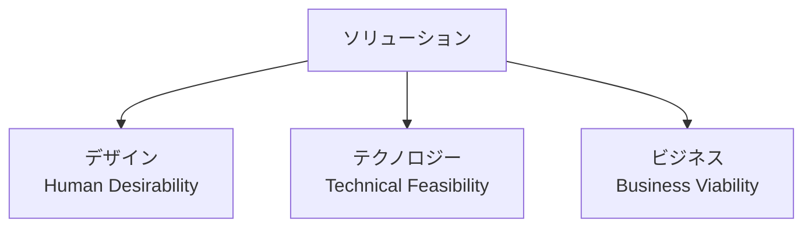

# ソリューション基礎

## 目次

- [3限目: イントロダクションと自己紹介](#3限目-イントロダクションと自己紹介)
  - [1. コース概要・進め方 (10分)](#1-コース概要進め方-10分)
    - [1.2 この演習で目指すこと](#12-この演習で目指すこと)
    - [1.3 評価の観点](#13-評価の観点)
  - [2. ソリューションとは (15分)](#2-ソリューションとは-15分)
    - [2.3 ソリューションを実現する体制の変化](#23-ソリューションを実現する体制の変化)
  - [3. 自己紹介](#3-自己紹介)
    - [3.1 講師自己紹介 (10分×2名 = 20分)](#31-講師自己紹介-10分2名--20分)
    - [3.2 学生自己紹介 (1人あたり4〜5分を目安)](#32-学生自己紹介-1人あたり45分を目安)
- [4限目: AIとまとめ](#4限目-aiとまとめ)
  - [4. AIは使えるか？ (30分)](#4-aiは使えるか-30分)
  - [5. 身近なソリューションを見つけてみよう (30〜40分)](#5-身近なソリューションを見つけてみよう-3040分)
  - [6. まとめ・次回予告](#6-まとめ次回予告)
- [参考](#参考)


# 3限目: イントロダクションと自己紹介

## 1. コース概要・進め方 (10分)

### 1.1 ソフトウェア開発演習について

本演習は全7回（1回あたり最大2コマ）で構成され、ソリューションデザインの基礎からデザイン思考、ソフトウェア開発方法論、ソリューショニング、プロトタイピング、ケーススタディまでを一貫して学びます。シラバス上は全14回に分かれていますが、内容の近い2回分をまとめて1日（2コマ）で実施します。

| 回数       |           1            |                        2                        |                  3                  |                     4                       |                     5                     |                     6                     |                       7                       |
| ---------- | :--------------------: | :----------------------------------------------: | :----------------------------------: | :------------------------------------------: | :-----------------------------------------: | :-----------------------------------------: | :---------------------------------------------: |
| テーマ     | **ソリューション基礎** | ソフトウェア開発方法論とアジャイルワークショップ | デザイン思考を用いたユーザー中心のデザイン | ソリューショニングとプロトタイピング       | 対話と問いを用いた価値のデザイン           | ケーススタディ: デザインと演習問題         | ケーススタディ: ソリューショニングと成果発表   |
| シラバス回 |       第1-2回          |                     第7-8回                     |               第3-4回               |                   第9-10回                   |                   第5-6回                   |                  第11-12回                  |                    第13-14回                    |
| 担当講師   |     **小島、竹田**     |                      小島                      |                竹田                |                    小島                    |                    竹田                    |                  小島、竹田                 |                    小島、竹田                    |

各回には事前学習・事後学習が設定されています。事前学習は授業の理解を助ける準備、事後学習は授業内容の定着を目的としています。詳細はシラバスを参照してください。

> [!Note]
>
> 本演習では生成AIを含む最新のデジタルツールの活用を前提としています。ただし、AIはあくまで思考や検討を補助する手段であり、課題や発表における最終的な判断・結論は自分自身の考えとして説明できるようにしましょう。

### 1.2 この演習で目指すこと

この演習では、期末の評価観点でもある次の5つの力を、7回を通して身につけていきます。

- **アーキテクチャ基礎の理解**: シンプルなシステムを設計できる
- **テクノロジーを用いたデザイン思考の理解**: ユーザーに基づいた問題解決に適用できる
- **ソリューションデザインの理解**: アーキテクチャとデザイン思考を統合し、一貫したソリューションを設計できる
- **ソフトウェア開発方法論の理解（特にアジャイル開発）**: 実装や運用を前提とした設計上の判断ができる
- **テクノロジーを活用した問題解決手法の理解**: 課題の性質を見極め、適切なテクノロジーを選んで方針を立てられる

これまで「プログラミング基礎」や「アプリケーション開発演習」などの授業を通して、みなさんは自分の力である程度のものを作れるようになってきているはずです。ただしそれは、多くの場合「一人で作る」ことを前提にした力です。

実際の開発は複数人のチームで進めることがほとんどで、「チームでどう開発を進めるか」は、個人のコーディング力とはまた別の技術です。実は、ソフトウェアの開発方法そのものを研究する「ソフトウェア工学」という学問領域があり、世界中で「どうすればよりよく開発できるか」というプロセスの見直し・改善が日々行われています。ウォーターフォールやアジャイルといった開発方法論も、その積み重ねの中で生まれてきたものです。次回（第2回）は、この「ソフトウェア開発方法論」を扱います。

半年後には「ソリューションの構想からプロトタイプの実装までを、自分(たち)の力で一通り動かせる」状態を目指します。

7回の流れは、次のようなストーリーになっています。

1. **ソリューションの考え方**を身につける(第1回)
2. **開発の進め方**(ウォーターフォール/アジャイル)を理解する(第2回)
3. **ユーザー中心のデザイン思考**を学ぶ(第3回)
4. 実際に手を動かして**ソリューショニング・プロトタイピング**を行う(第4回)
5. **対話や問い**を通じて価値の認識を合わせる力を磨く(第5回)
6. **ケーススタディ**を通じてこれまでの学びを統合し、自分たちのソリューションを設計・発表する(第6-7回)

### 1.3 評価の観点

上記5つの力は、期末レポート課題と授業内のパフォーマンス課題を通じて、それぞれ均等（各20%）に評価します。1回ごとに完璧を目指す必要はありません。7回を通して少しずつ積み上げていきましょう。


## 2. ソリューションとは (15分)

事前学習で「価値・課題・技術」といった用語に軽く触れてきていますが、ここからが「ソリューション」という考え方を学ぶ本番です。

### 2.1 ソリューションの定義

**ソリューション**とは、特定の問題や課題を解決するための方法や手段を指す、非常に広い概念です。本演習では特に、情報技術（IT）を活用して課題を解決する `ITソリューション` に焦点を当てます。

ソリューションを考える上で重要なのは、**価値・課題・技術**の関係を整理することです。

- **課題**: 誰の、どんな困りごとを解決したいのか
- **価値**: それを解決すると、誰にとってどんな価値が生まれるのか
- **技術**: その価値をどんな技術・手段で実現するのか

### 2.2 イノベーションの3つのレンズ

ソリューションを設計する際は、次の3つの視点のバランスが重要になります。



- **デザイン（Human Desirability）**: ユーザーにとって本当に必要か、使いやすいか
- **テクノロジー（Technical Feasibility）**: 技術的に実現可能か
- **ビジネス（Business Viability）**: ビジネスとして成立するか

この3つの視点は、今後の回（デザイン思考・ソリューショニング・ケーススタディ等）で繰り返し使う基本フレームワークです。

### 2.3 ソリューションを実現する体制の変化

これまで、ソリューションを実現するには「ビジネス」「デザイン」「エンジニアリング」「データ」といった役割ごとに専門家を揃えるのが一般的でした。それぞれの専門性が高く、一人がすべてをカバーするのは難しかったからです。

生成AIの登場により、この前提が揺らぎ始めています。デザイナーがコードを書いてプロトタイプを作ったり、エンジニアがAIを使ってUIの文言や画像を用意したりと、**役割の越境**が起きやすくなりました。これを受けて、「一人であらゆる役割をこなす**ソロプレナー**」が主流になる、という論調も見かけます。

ただし、一人ですべてをやり切るというのは、少し大袈裟な見方だと私たちは考えています。実際に起きていく変化として可能性が高いのは、**少人数のチームがAIを活用し、以前よりずっと大きな成果を生み出す**という形です。役割の壁が低くなることで、少ない人数でもビジネス・デザイン・エンジニアリングの視点を行き来しながらソリューションを作れるようになる——これが、この後の「AIは使えるか？」で扱うテーマにもつながっていきます。


## 3. 自己紹介

### 3.1 講師自己紹介 (10分×2名 = 20分)

#### 小島 弘誉（こじま ひろたか）

```
専門分野: ソフトウェア工学 / ソリューションアーキテクト

略歴:
  通信事業会社にて6年、パブリッククラウド（仮想サーバ）の開発・運用等を経験。
  本業以外でもグループ全体のアプリコンテストに出場し、UX賞・最優秀賞を受賞。
  その後、自動車部品メーカーにて3年、XP(Extreme Programming)を用いた
  新規事業（アプリ、プラットフォーム）のプロトタイプ開発を経験。
  現在は、仮説検証を素早く回しながら顧客の課題解決に取り組むソリューション
  アーキテクトとして活動中。
```

#### 竹田 周平（たけだ しゅうへい）

```
専門分野: コラボレーティブデザイン

略歴:
  国内IT企業（米国勤務）、外資IT企業複数社にて、テクノロジーソリューションの
  デザインに従事。ソフトウェアのUI/UXデザイン、ユーザーリサーチ、デザイン思考
  を用いたソリューションデザイン、共創のファシリテーションなど多数経験。
  IPA未踏スーパークリエータ認定（2010）。京都芸術大学非常勤講師（2019-）。
```

### 3.2 学生自己紹介 (1人あたり4〜5分を目安)

講師の自己紹介が終わったら、続けて学生の皆さんにも一人ずつ自己紹介をしてもらいます。人数によって持ち時間は調整してください（想定20名・最大30名程度のため、時間が足りない場合は1人あたりの時間短縮やグループ内での実施に切り替えます）。

テンプレート案:

```
名前:
興味のあること:
趣味:
この授業に期待していること:
将来やってみたいこと:
```


# 4限目: AIとまとめ

## 4. AIは使えるか？ (30分)

### 4.1 生成AIは自分たちの武器になるか

生成AIの進化はすさまじいスピードで進んでいます。一方で、「AIは便利そうだけど、自分の学びや将来に本当に使えるものなのか？」と感じている人も多いのではないでしょうか。

先ほど2.3で触れた「少人数チームがAIを活用して大きな成果を生む」という変化は、すでに現実の事例として起き始めています。

この演習では、AIを「答えを教えてくれる道具」としてではなく、**自分の考えを深めたり、手を動かすスピードを上げたりするための相棒**として捉えることを大切にします。

### 4.2 少人数チームでも大きな成果を出せる時代

近年、Cursor（開発元: Anysphere社）のように、少人数のチームが生成AIを徹底的に活用することで、短期間のうちに世界中の開発者に使われるプロダクトを生み出す例が増えています。従来は大きな組織でなければ実現できなかったような成果を、アイデアと技術力、そしてAIの活用次第で少人数でも達成できる時代になってきています。

> [!Note]
>
> 気になる人は、Cursor以外にも「少人数・スタートアップがAIを活用して成果を出している事例」をAI（ChatGPT/Gemini/Perplexity等）に聞いて調べてみましょう。
>
> ```
> (例) 生成AIを活用して少人数で大きな成果を出しているスタートアップの例を教えてください。
> ```

### 4.3 自分にとってAIは使えそうか、共有しよう

以下をslackのチャネルに書いてみましょう。

```
名前:
AIを使ったことがある/ない:
AIは自分にとって「使えそう」だと思うか、その理由:
不安に感じていること・気になっていること:
```


## 5. 身近なソリューションを見つけてみよう (30〜40分)

ここまで学んだ「価値・課題・技術」と「3つのレンズ」を使って、実際に身の回りのソリューションを分析してみましょう。第6-7回のケーススタディにもつながる練習です。

### 5.1 個人ワーク: ソリューションを1つ選ぶ (5分)

自分がよく使っているアプリやサービスを1つ選びます。

### 5.2 3つのレンズで分析する (10分)

```
名前:
選んだソリューション:

課題（誰の、どんな困りごとを解決しているか）:
価値（解決すると誰にとってどんな価値が生まれるか）:
技術（どんな技術・手段で実現しているか）:

デザイン（Human Desirability）:
テクノロジー（Technical Feasibility）:
ビジネス（Business Viability）:
```

### 5.3 ペアで共有する (10〜15分)

クラス全員が発表すると時間が足りないため、2人1組になって、選んだソリューションと分析結果をお互いに共有します。相手の分析にコメント・質問をしてみましょう。

### 5.4 全体共有 (5〜10分、時間に応じて)

時間が残っていれば、何人かに全体の前で紹介してもらいます。

（人数や時間に応じて、5.3・5.4の時間配分は調整してください。）


## 6. まとめ・次回予告

- 次回は「ソフトウェア開発方法論とアジャイルワークショップ」をテーマに、ウォーターフォールとアジャイルの違いや、アジャイル型の進め方を体験していきます。
- 開発環境の構築（利用するツール等は今後案内予定）は、別回であらためて実施します。


## 参考

1. ### [ChatGPT](https://chatgpt.com/)

2. ### [Gemini](https://gemini.google.com/app)

3. ### [IDEO Design Thinking Defined](https://designthinking.ideo.com/)
