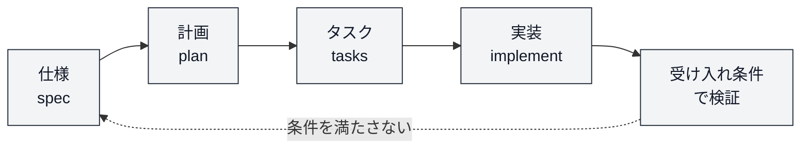
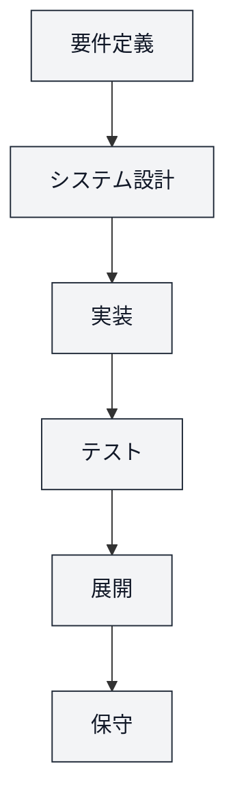
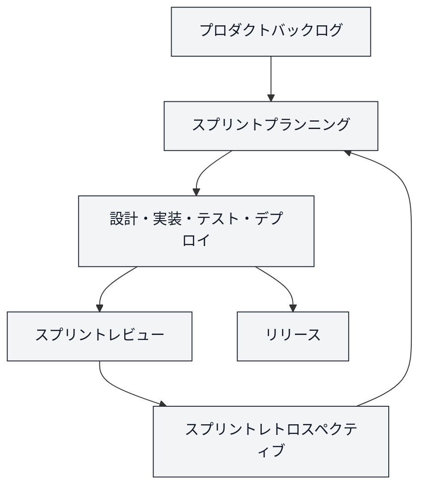

# ソフトウェア開発方法論とアジャイルワークショップ

## 目次

- [3限目: ソフトウェア開発方法論](#3限目-ソフトウェア開発方法論)
  - [1. イントロダクションとセットアップ (20分)](#1-イントロダクションとセットアップ-20分)
    - [1.1 まず、ダウンロードを始めます](#11-まずダウンロードを始めます)
    - [1.2 この演習の全体像（7回）](#12-この演習の全体像7回)
    - [1.3 前回の振り返り](#13-前回の振り返り)
    - [1.4 今日のゴール](#14-今日のゴール)
    - [1.5 セットアップの続き](#15-セットアップの続き)
  - [2. 演習A: まずは作ってみよう (10分)](#2-演習a-まずは作ってみよう-10分)
  - [3. 受け入れ確認 その1 (4分)](#3-受け入れ確認-その1-4分)
  - [4. 考えてみよう その1: なぜ通らなかったのか? (5分)](#4-考えてみよう-その1-なぜ通らなかったのか-5分)
  - [5. ソフトウェア開発方法論とは / なぜ必要か (6分)](#5-ソフトウェア開発方法論とは--なぜ必要か-6分)
    - [5.1 開発方法論とは「作り方の型」](#51-開発方法論とは作り方の型)
    - [5.2 なぜ必要か: 決めていないと起きること](#52-なぜ必要か-決めていないと起きること)
    - [5.3 ソフトウェア工学という領域](#53-ソフトウェア工学という領域)
    - [5.4 方法論の地図](#54-方法論の地図)
    - [5.5 銀の弾丸はない](#55-銀の弾丸はない)
  - [6. 方法論の一つ: 仕様駆動開発 (6分)](#6-方法論の一つ-仕様駆動開発-6分)
    - [6.1 バイブコーディングが得意なこと](#61-バイブコーディングが得意なこと)
    - [6.2 仕様とは「頭の中の条件を書き留めたもの」](#62-仕様とは頭の中の条件を書き留めたもの)
    - [6.3 仕様駆動開発の流れ](#63-仕様駆動開発の流れ)
    - [6.4 使うツール: GitHub Spec Kit](#64-使うツール-github-spec-kit)
  - [7. 演習B: 仕様駆動開発をやってみる (14分)](#7-演習b-仕様駆動開発をやってみる-14分)
    - [7.1 受け入れ条件を自分で書く](#71-受け入れ条件を自分で書く)
    - [7.2 仕様書を作ってレビューする](#72-仕様書を作ってレビューする)
    - [7.3 計画・タスク・実装](#73-計画タスク実装)
  - [8. 受け入れ確認 その2: AとBで何が変わったか (4分)](#8-受け入れ確認-その2-aとbで何が変わったか-4分)
  - [9. 演習C: では、チームで作ってみよう (12分)](#9-演習c-ではチームで作ってみよう-12分)
  - [10. 考えてみよう その2: チームだと何が難しい? (7分)](#10-考えてみよう-その2-チームだと何が難しい-7分)
  - [11. チームで効くソフトウェア開発方法論 (10分)](#11-チームで効くソフトウェア開発方法論-10分)
    - [11.1 ウォーターフォール型](#111-ウォーターフォール型)
    - [11.2 アジャイル型](#112-アジャイル型)
    - [11.3 リーン型](#113-リーン型)
    - [11.4 DevOps / CI・CD](#114-devops--cicd)
    - [11.5 比較表と使い分け](#115-比較表と使い分け)
    - [11.6 やってみよう: この案件、どう進める?](#116-やってみよう-この案件どう進める)
  - [12. 3限目まとめ・4限目予告 (2分)](#12-3限目まとめ4限目予告-2分)
- [4限目: アジャイルワークショップ](#4限目-アジャイルワークショップ)
  - [13. マシュマロチャレンジとは (7分)](#13-マシュマロチャレンジとは-7分)
  - [14. チャレンジ #1 (18分)](#14-チャレンジ-1-18分)
  - [15. 計測・結果発表・感想 #1 (8分)](#15-計測結果発表感想-1-8分)
  - [16. 解説: なぜこれをやったのか (14分)](#16-解説-なぜこれをやったのか-14分)
    - [16.1 いま何をしていたのか](#161-いま何をしていたのか)
    - [16.2 マシュマロチャレンジとスクラムの対応](#162-マシュマロチャレンジとスクラムの対応)
    - [16.3 アジャイルの前提と Fail fast](#163-アジャイルの前提と-fail-fast)
    - [16.4 だから、次にやること](#164-だから次にやること)
  - [17. 振り返り #1 と改善計画 (10分)](#17-振り返り-1-と改善計画-10分)
  - [18. チャレンジ #2 (18分)](#18-チャレンジ-2-18分)
  - [19. 計測・結果発表・感想 #2 (8分)](#19-計測結果発表感想-2-8分)
  - [20. 解説: マシュマロチャレンジそのものの話 (12分)](#20-解説-マシュマロチャレンジそのものの話-12分)
    - [20.1 TEDの知見: 幼稚園児・ファシリテーター・賞金](#201-tedの知見-幼稚園児ファシリテーター賞金)
    - [20.2 「顧客が本当に必要だったもの」](#202-顧客が本当に必要だったもの)
    - [20.3 3限目とのつながり](#203-3限目とのつながり)
  - [21. まとめ (5分)](#21-まとめ-5分)
- [課題と評価](#課題と評価)
- [講師向けメモ](#講師向けメモ)
- [参考](#参考)

---

# 3限目: ソフトウェア開発方法論

| # | 内容 | 時間 | 形式 |
| --- | --- | --- | --- |
| 1 | **イントロダクションとセットアップ**（ダウンロードの待ち時間に全体像を話す） | 20分 | 全体 |
| 2 | **演習A**: まずは作ってみよう | 10分 | 2人1チーム |
| 3 | 受け入れ確認 その1 | 4分 | 全体 |
| 4 | **考えてみよう その1**: なぜ通らなかったのか? | 5分 | ペア→全体 |
| 5 | ソフトウェア開発方法論とは / なぜ必要か | 6分 | 講義 |
| 6 | 方法論の一つ: 仕様駆動開発 | 6分 | 講義 |
| 7 | **演習B**: 仕様駆動開発をやってみる | 14分 | 2人1チーム |
| 8 | 受け入れ確認 その2: AとBで何が変わったか | 4分 | 全体 |
| 9 | **演習C**: では、チームで作ってみよう | 12分 | 3〜5名×3〜4チーム |
| 10 | **考えてみよう その2**: チームだと何が難しい? | 7分 | チーム→全体 |
| 11 | チームで効くソフトウェア開発方法論 | 10分 | 講義 |
| 12 | まとめ・4限目予告 | 2分 | 講義 |
| | **合計** | **100分** | |

## 1. イントロダクションとセットアップ (20分)

### 1.1 まず、ダウンロードを始めます

今日は **Antigravity IDE** という開発環境を使います。**先にダウンロードを始めてください。**（数百MBあるので、話を聞きながら裏で落とします）

> [!IMPORTANT]
> **手順書を開いて、上から順に進めてください** → **[Antigravity IDE のセットアップ手順](./setup-antigravity-ide.md)**
>
> いま進めるのは手順書の **1〜2**（PCの種類を確認する → ダウンロードを始める）だけです。
> ダウンロードページには似た名前のものが4つ並んでいます。選ぶのは **「Antigravity IDE Standalone」** です。「Antigravity 2.0」ではありません。
>
> 直接飛べるリンク → **https://antigravity.google/download#antigravity-ide**
>
> **今日使うリンクはすべて、Slackの授業チャンネルに投稿してあります**（ピン留め済み）。手で打たずにそこからクリックしてください。

ダウンロードが始まったら、いったん手を止めて話を聞いてください。**その間に、この演習の全体像を説明します。**

### 1.2 この演習の全体像（7回）

本演習は全7回（1回あたり2コマ・各100分）で構成されます。シラバス上は全14回ですが、内容の近い2回分をまとめて1日（2コマ）で実施します。**今日は第2回**です。

| 回数 | 1 | **2** | 3 | 4 | 5 | 6 | 7 |
| --- | --- | --- | --- | --- | --- | --- | --- |
| テーマ | ソリューション基礎 | **ソフトウェア開発方法論とアジャイルワークショップ** | デザイン思考を用いたユーザー中心のデザイン | ソリューショニングとプロトタイピング | 対話と問いを用いた価値のデザイン | ケーススタディ: デザインと演習問題 | ケーススタディ: ソリューショニングと成果発表 |
| シラバス回 | 第1-2回 | **第7-8回** | 第3-4回 | 第9-10回 | 第5-6回 | 第11-12回 | 第13-14回 |
| 担当講師 | 小島、竹田 | **小島** | 竹田 | 小島 | 竹田 | 小島、竹田 | 小島、竹田 |

7回は、次のストーリーでつながっています。

1. **ソリューションの考え方**を身につける（第1回 ✅ 済み）
2. **開発の進め方**（ウォーターフォール / アジャイル）を理解する（**第2回 ← 今日**）
3. **ユーザー中心のデザイン思考**を学ぶ（第3回）
4. 実際に手を動かして**ソリューショニング・プロトタイピング**を行う（第4回）
5. **対話や問い**を通じて価値の認識を合わせる力を磨く（第5回）
6. **ケーススタディ**で学びを統合し、自分たちのソリューションを設計・発表する（第6-7回）

今日学ぶ「進め方」は、**第4回でチームでプロトタイプを作るときに実際に使います**。今日の内容は、期末評価の観点4「アジャイル開発、ソフトウェア技術に関する基礎知識の理解」に対応します。

### 1.3 前回の振り返り

第1回では「ソリューションとは何か」を扱いました。そこで、こんな話をしました。

> これまでの授業で、みなさんは自分の力である程度のものを作れるようになっている。ただしそれは「一人で作る」ことを前提にした力である。実際の開発はチームで進めることがほとんどで、「チームでどう開発を進めるか」は個人のコーディング力とは別の技術である。

今日はその「別の技術」を扱います。

### 1.4 今日のゴール

| | ゴール |
| --- | --- |
| 3限目 | **作り方（ソフトウェア開発プロセス）にも良し悪しがある**と分かる。方法論が複数あること、その使い分けを説明できる |
| 4限目 | **チームで反復して良くしていく**感覚を体で覚える |

各コマ100分です。今日は説明を聞く時間より、**手を動かす時間と考える時間**を多くとります。

### 1.5 セットアップの続き

ダウンロードが終わった人から、手順書の **3以降**を進めます。

| | 手順書の該当箇所 | やること |
| --- | --- | --- |
| 3 | [インストールする](./setup-antigravity-ide.md#3-インストールする) | Windowsは警告画面で「詳細情報」→「実行」。Macは右クリック→「開く」 |
| 4 | [ログインする](./setup-antigravity-ide.md#4-googleアカウントでログインする) | **個人の**Googleアカウントで。大学のアカウントでは使えない可能性があります |
| 5 | [日本語にする](./setup-antigravity-ide.md#5-日本語にする) | `Ctrl`+`Shift`+`X` →「Japanese」で検索 → Microsoft製をインストール → 再起動 |
| 6 | [画面の見方](./setup-antigravity-ide.md#6-画面の見方とファイルの場所) | 左=エクスプローラー（ファイルの場所）／中央=エディタ／右=エージェント（AIに頼む場所） |
| 7 | [フォルダを用意する](./setup-antigravity-ide.md#7-演習で使うフォルダを用意する) | `ソフトウェア開発演習/第2回/vibe-coding` を作って開く／自分のOSのZIP（[Windows](https://raw.githubusercontent.com/Creative-Cucumbers/solution-design-with-technology/main/2026/2_software_development_methodology_agile/starter-windows.zip) / [Mac](https://raw.githubusercontent.com/Creative-Cucumbers/solution-design-with-technology/main/2026/2_software_development_methodology_agile/starter-mac.zip)）を `第2回` で展開する |

**詰まったらすぐ手を挙げてください。** セットアップで詰まるのは普通のことで、そのための時間です。

> [!NOTE]
> **今日 Antigravity IDE を使う理由**: Antigravityには4つの形態（2.0 / IDE / CLI / SDK）がありますが、**IDEは「いま開いているフォルダ」の中でAIが作業するので、どこにファイルができたのかが画面で見えます**。今日は「何が作られたか」を自分の目で確かめることが大事なので、IDEを使います。

> [!CAUTION]
> - 無料のパブリックプレビューのため、**利用回数に制限**があります（一定時間で回復します）
> - 利用規約上、**入力した内容がGoogleに参照される可能性**があります。個人情報や、人に見せられない内容は入力しないでください

> [!TIP]
> **入らなかった人・間に合わなかった人**: 演習は2人1組なので、**ペアで1台動いていれば参加できます。** 隣の人と一緒に画面を見てください。

---

## 2. 演習A: まずは作ってみよう (10分)

さっそく作ってみましょう。お題はこれだけです。

> [!NOTE]
> **お題**
>
> ```
> グループワークで使えるタイマーを作ってください
> ```
>
> - 2人1チームで、1台のPCを一緒に見ながら進めます
> - Antigravity IDE のエージェント（画面右側のチャット）に上の一言を投げて、そのまま走らせてください
> - 出てきたものを触って、気になる所は会話で直していきます
> - 制作時間は**8分**

質問があっても、今回は「お任せします」としか答えません。自由に作ってください。

> [!TIP]
> **バイブコーディングが初めての人へ**: [はじめてのバイブコーディング](./vibe-coding-first-steps.md) に、始め方・動かし方・直し方の例文をまとめてあります。手が止まったら開いてください。
> ペアは**経験のある人と初めての人**を組み合わせています。経験がある人は、操作を代わりにやってしまわず、**相手に操作してもらって口で教える**ようにしてください。

---

## 3. 受け入れ確認 その1 (4分)

では、**お客さん役**として確認します。

講師が読み上げる条件を聞いて、自分たちの画面で満たせているかを `○` / `×` で数えてください。

（条件は講師が口頭で読み上げます）

集計してみましょう。

- 5つ全部通った人
- 3つ以上通った人
- 1つ以下だった人

> [!IMPORTANT]
> **落ちるように作ってあります。腕の問題ではありません。**
> この5つの条件は、最初から講師の頭の中にありました。みなさんには一言も伝えていません。

---

## 4. 考えてみよう その1: なぜ通らなかったのか? (5分)

ペアで2分話して、その後に全体で出してください。出てきたものは**ホワイトボードに全部書き出します**（後で使います）。

> [!NOTE]
> **問い**
>
> - なぜ、条件が通らなかったのだと思いますか?
> - 「一言プロンプトで作る」という作り方だけだと、どんな問題が起きると思いますか?

考える取っ掛かりが欲しいときは、次の問いを使ってください。

- そもそも自分たちは、何を作るつもりだったか説明できますか?
- 条件を先に聞けたとしたら、何を聞きましたか?
- どこまでできたら「完成」でしたか?
- 同じものを、もう一度作れますか?
- ペアの相手は、中身を説明できますか?

---

## 5. ソフトウェア開発方法論とは / なぜ必要か (6分)

### 5.1 開発方法論とは「作り方の型」

**ソフトウェア開発方法論**とは、次のようなことを決めた**作り方の型**です。

- **何を作るか**をどう決めるか
- **どの順で**進めるか
- **誰が何を**やるか
- **どこまでできたら完成**とするか

コードの書き方の話ではありません。**進め方**の話です。

### 5.2 なぜ必要か: 決めていないと起きること

ホワイトボードを見てください。いま出てきたものは、全部**「作り方が決まっていないと起きること」**です。

| さっき出た問題 | 方法論ではこう呼ばれている |
| --- | --- |
| 何を作るつもりだったか言葉になっていない | **要件定義 / 仕様** |
| どこまでできたら完成か決まっていない | **受け入れ条件 / 完成の定義** |
| 後から要求が来ると崩れる | **反復（イテレーション）と優先順位付け** |
| 他の人に説明できない | **ドキュメント / レビュー** |
| 本当に動くか確かめていない | **テスト** |

これらは、みなさんが今日初めてぶつかった問題ではありません。**同じことで困った人たちが、50年以上かけて型を作ってきました。**

### 5.3 ソフトウェア工学という領域

ソフトウェアの作り方そのものを研究する **ソフトウェア工学（Software Engineering）** という学問領域があります。世界中で「どうすればよりよく開発できるか」というプロセスの見直しと改善が今も続いています。今日扱うウォーターフォールやアジャイルも、その積み重ねの中で生まれてきたものです。

### 5.4 方法論の地図

方法論には、**一人でも効くもの**と**チームで効くもの**があります。

```mermaid
graph LR
    subgraph 一人〜小規模でも効く型
        A1[仕様駆動開発<br/>SDD]
        A2[テスト駆動開発<br/>TDD]
    end
    subgraph チームで効く型
        B1[ウォーターフォール]
        B2[アジャイル<br/>スクラム / XP]
        B3[リーン]
        B4[DevOps]
    end
    classDef default fill:#f3f4f6,stroke:#1f2937,color:#111827;
```

歴史の流れとしては、おおまかに次の順で生まれてきました。


今日は、**さっき詰まった所に一番効く型**から見ていきます。地図の左側、一人でも効く「仕様駆動開発」です。チーム側の型は、9節でもう一度詰まってもらった後に扱います。

### 5.5 銀の弾丸はない

先に大事なことを言っておきます。**どの方法論が正解、というものはありません。**

選ぶときの軸は2つです。

- **何が不確かなのか**（作るものが決まっているのか、誰が使うかも分からないのか）
- **失敗のコストはどれくらいか**（作り直せるのか、人命や法律が関わるのか）

---

## 6. 方法論の一つ: 仕様駆動開発 (6分)

### 6.1 バイブコーディングが得意なこと

AIに話しかけて勢いで作るやり方を **バイブコーディング（vibe coding）** と呼びます。今日はこれを否定しに来たのではありません。得意なことがはっきりあります。

- **速い**。ゼロから動くものが数分で出てくる
- **試すのに向く**。捨てる前提のアイデア検証には最適
- **一人で完結する**。誰とも相談しなくていい

問題は、**それしか持っていない**ことです。

### 6.2 仕様とは「頭の中の条件を書き留めたもの」

さっきの5つの条件は、講師の頭の中にありました。お客さんは、自分の要求を全部言ってはくれません。

**仕様（spec）とは、お客さんの頭の中にある条件を引き出して、書き留めたものです。**

「仕様書を書く」というと堅苦しく聞こえますが、やることは「後で揉めそうなことを先に紙に書く」だけです。

### 6.3 仕様駆動開発の流れ

**仕様駆動開発（SDD: Spec-Driven Development）** は、仕様を中心に置いて、その先を組み立てる進め方です。



大事なのは、**各段で人間が承認する**ことです。

> AIに丸投げするのではなく、**AIが出したものを人間がレビューする**。これが今の開発の形です。

### 6.4 使うツール: GitHub Spec Kit

この型を実際に使うために、**[GitHub Spec Kit](https://github.com/github/spec-kit)** を使います。2025年9月にGitHubが公開したツールキットで、GitHub Copilot / Claude Code / Gemini CLI / Cursor / **Antigravity** などで動きます。

配布した [starter](./starter) に最初から入っています。使うコマンドは4つです。

| コマンド | 何をするか |
| --- | --- |
| `/speckit-specify` | 仕様書（`spec.md`）を作る |
| `/speckit-plan` | 実装の計画（`plan.md`）を作る |
| `/speckit-tasks` | タスク一覧（`tasks.md`）を作る |
| `/speckit-implement` | タスクに沿って実装する |

---

## 7. 演習B: 仕様駆動開発をやってみる (14分)

同じお題を、今度は仕様駆動でやり直します。

### 7.1 受け入れ条件を自分で書く

まず、セットアップで展開した **`ソフトウェア開発演習/第2回/starter-windows`**（Macの人は `starter-mac`）を Antigravity IDE で開いてください（**ファイル → フォルダーを開く**）。中身の説明は [starter/README.md](./starter/README.md) にあります。

> [!WARNING]
> **開くのは `starter-windows` / `starter-mac` フォルダそのものです。** 親フォルダ（`第2回`）を開くと、この演習で使うコマンドが読み込まれません。
> `/speckit-` と打ってコマンドの一覧が出れば正しく開けています。出ない場合は、開いたフォルダを確認してから、ウィンドウを再読み込みしてください。

> [!NOTE]
> **やること（3分）**
>
> 先ほど講師が読み上げた5つの条件と、追加で1つ（講師が指定します）を、**自分の言葉で書き出してください。**
>
> ```
> ## 受け入れ条件
> 1.
> 2.
> 3.
> 4.
> 5.
> 6.
> ```

ここはAIに任せません。**「どこまでできたら完成か」を決めるのは人間の仕事**です。

### 7.2 仕様書を作ってレビューする

> [!NOTE]
> **やること（5分）**
>
> 1. `/speckit-specify` に「お題 ＋ 自分で書いた受け入れ条件」を渡す
> 2. 生成された `spec.md` を**読んでレビューする**
>    - 6つの条件が全部入っているか
>    - 勝手に決められた前提が混ざっていないか
>    - 足りない所、違う所を直す

`spec.md` は `specs/` フォルダの下に作られます。

### 7.3 計画・タスク・実装

> [!NOTE]
> **やること（6分）**
>
> 1. `/speckit-plan` → 計画（`plan.md`）ができる
> 2. `/speckit-tasks` → タスク一覧（`tasks.md`）ができる。**受け入れ条件がタスクに紐づいているか**を確認する
> 3. `/speckit-implement` → 実装が始まる

実装が走っている数分間は、待ちながら講師の話を聞いてください（現場での仕様駆動開発の話をします）。

終わったら、手元を見てください。**`spec.md` / `plan.md` / `tasks.md` がファイルとして残っています。** これが演習Aとの決定的な違いです。この3つがあれば、他の人が続きを作れます。

---

## 8. 受け入れ確認 その2: AとBで何が変わったか (4分)

同じ条件で、もう一度お客さん役の確認をします。数えてください。

| | 演習A（バイブコーディング） | 演習B（仕様駆動） |
| --- | --- | --- |
| 通った条件の数 | | |

2つの軸で振り返ってみましょう。

- **意図との一致**: 作りたかったものになっているか
- **変更への強さ**: 「実はこうしたい」と言われたときに耐えられるか

一人で作るときでさえ、**先に条件を言葉にするだけでこれだけ変わります。**

では、**人数が増えたらどうなるでしょうか。**

---

## 9. 演習C: では、チームで作ってみよう (12分)

ペアを合流させて、**3〜5名のチーム**を作ります（人数によって3〜4チーム。講師が指定します）。チーム名だけ決めてください（1分）。

> [!NOTE]
> **お題: 授業のグループワーク運営ツール**
>
> チームで**1つ**のアプリを作ってください。機能は4つとも必須です。
>
> 1. 複数チームの時間を**並行して**計れるタイマー
> 2. チームごとの**記録（数値）を入力**できる
> 3. 記録を**順位つきで一覧表示**できる
> 4. 各チームの**振り返りメモ**を残せる
>
> - ペアで作ったものを持ち寄って構いません
> - ただし**最終成果物はチームで1つ**です
> - 制作時間は**11分**

進め方は指示しません。**役割分担、誰が決めるか、どう1つにまとめるかは、チームで決めてください。**

質問されても「チームで決めてください」と答えます。

---

## 10. 考えてみよう その2: チームだと何が難しい? (7分)

4つの機能が1つのアプリに入っているか確認します（2分）。

その後、チームで2分話して、全体で出してください（板書まで含めて3分）。**ホワイトボードの2枚目に書き出します。**

> [!NOTE]
> **問い**
>
> - チームで作ると、何が難しかったですか?
> - **どうすればよかったと思いますか?**

講師が見ていて気づいたことも足します。言いにくいことは講師が代わりに言います。

いま「どうすればよかったか」として出てきたものは、**すでに方法論として存在するものの再発明**です。次でそれを見ます。

---

## 11. チームで効くソフトウェア開発方法論 (10分)

5.4の地図に戻ります。今度は**チーム側**の型を開きます。

みなさんが出した「難しかったこと」は、次のように解かれてきました。

| さっき出た難しさ | 方法論での答え |
| --- | --- |
| 誰が何をやるか決まらない | スクラムの**役割**（プロダクトオーナー / スクラムマスター / 開発チーム） |
| 何をいつやるか分からない | **プロダクトバックログ**と**スプリント計画** |
| 状況が共有されない | **デイリースクラム**（毎日の短い共有） |
| 完成の判断が合わない | **完成の定義（DoD）** と**受け入れ条件**（7節で書いたもの） |
| 同時に触って衝突する | **バージョン管理**・**CI/CD** |
| 同じ失敗を繰り返す | **レトロスペクティブ**（振り返り／4限目で体験します） |
| 期日も範囲も動かせない | **ウォーターフォール** |
| 手が空く人・無駄な作業が出る | **リーン** |

### 11.1 ウォーターフォール型

ウォーターフォール（滝）型は、直線的で順序立てたプロセスです。各フェーズが完了してから次に進み、前のフェーズに戻ることはあまり想定されていません。



- **メリット**: 明確な段階と成果物があり、計画が管理しやすい
- **デメリット**: 変更に柔軟に対応しづらく、後戻りが難しい
- **向く場面**: 期日と範囲が動かせない案件（法改正対応、大規模な基幹システム、規制の厳しい分野）
- **落とし穴**: 最後まで動くものが出てこないので、間違いに気づくのが遅い

### 11.2 アジャイル型

アジャイルは、**反復的かつ段階的**に進める手法です。**スプリント**（短期間の開発サイクル）で作り、その都度フィードバックを受けて修正・改善します。



- **メリット**: 柔軟に変更対応ができ、早い段階で価値を提供できる
- **デメリット**: 長期的な計画が見えにくくなることがある
- **向く場面**: 誰がどう使うか不確かな新規サービス、ユーザーの反応を見ながら育てるもの
- **落とし穴**: 「計画しない言い訳」に使われる。反復すること自体が目的化する

#### スクラム: 役割・イベント・バックログ

アジャイルの代表的な進め方が**スクラム**です。演習Cで困ったことが、そのまま仕組みになっています。

| 要素 | 何か | 演習Cのどの困りごとに効くか |
| --- | --- | --- |
| プロダクトオーナー | 何を作るか・優先順位を決める人 | 「誰が決めるのか分からない」 |
| スクラムマスター | チームが進めやすいようにする人 | 「手が空く人が出る」「話が進まない」 |
| 開発チーム | 実際に作る人たち | |
| プロダクトバックログ | やることリスト（優先順位つき） | 「何から手をつけるか揉める」 |
| スプリント | 1〜4週間の区切り | 「終わりが見えない」 |
| デイリースクラム | 毎日の短い共有 | 「隣が何をしているか知らない」 |
| スプリントレビュー | 成果を見せてフィードバックをもらう | 「完成の判断が合わない」 |
| レトロスペクティブ | 進め方を振り返って改善する | 「同じ失敗を繰り返す」 |

#### アジャイルソフトウェア開発宣言

2001年に書かれた4つの価値観です。

- プロセスやツールよりも **個人と対話** を
- 包括的なドキュメントよりも **動くソフトウェア** を
- 契約交渉よりも **顧客との協調** を
- 計画に従うことよりも **変化への対応** を

> [!NOTE]
> 右側の項目に価値がないと言っているのではありません。**左側の項目により価値を置く**という宣言です。

#### XP（エクストリーム・プログラミング）

アジャイルの中でも、技術プラクティスを重視する進め方です。ペアプログラミング（2人で1台のPCで書く）、テスト駆動開発、継続的インテグレーション、小さなリリースなどを組み合わせます。

今日の演習A・Bで2人1台でやっていたのは、**ペアプログラミング**そのものです。

### 11.3 リーン型

無駄を省き、価値のある作業に集中することに重点を置く考え方です。製造業（トヨタ生産方式）から来ています。

- 顧客にとっての**価値を特定**する
- 価値が生まれる流れ（**バリューストリーム**）を可視化して、無駄を見つける
- 流れを滞らせない
- **継続的に改善**し続ける

新規事業では**リーンスタートアップ**として、「作る → 測る → 学ぶ」を小さく速く回す形で使われます。4限目で扱う **MVP（Minimum Viable Product）** はここから来た考え方です。

### 11.4 DevOps / CI・CD

作る人（Development）と運用する人（Operations）を分けず、協調して動かし続ける考え方です。

- **CI（継続的インテグレーション）**: コードを頻繁に統合し、自動でテストする。「同時に触って壊れる」問題への答え
- **CD（継続的デリバリー / デプロイ）**: リリースを自動化し、小さく何度も出す

演習Cで「2つを1つにまとめられなかった」のは、まさにインテグレーションの問題です。現場ではこれを**毎日、自動で**やっています。

### 11.5 比較表と使い分け

| | 要件の確かさ | 進め方 | 価値が出る単位 | 変化への強さ | 向く場面 | 落とし穴 |
| --- | --- | --- | --- | --- | --- | --- |
| **ウォーターフォール** | 決まっている前提 | 段階を順に | 最後に一度 | 弱い | 期日・範囲が固定、規制対応 | 気づくのが遅い |
| **アジャイル / スクラム** | 決まっていない前提 | 短い反復 | スプリントごと | 強い | 新規サービス、ユーザー未知 | 計画しない言い訳になる |
| **XP** | 決まっていない前提 | 短い反復＋技術規律 | 常に動く状態 | 強い | 少人数で品質も要る | 規律を守れないと崩れる |
| **リーン** | 仮説として扱う | 無駄を削る／学習を回す | 学びごと | 強い | 新規事業、業務改善 | 削りすぎて脆くなる |
| **DevOps** | （進め方と直交） | 自動化と協調 | リリースごと | 強い | 継続的に動かすサービス | 道具だけ入れて文化が変わらない |
| **AI駆動 / 仕様駆動** | 仕様として先に固める | 仕様→計画→タスク→実装 | タスクごと | 中〜強 | AIと一緒に作る全般 | 仕様を書かずにAIに投げる |

**選ぶときの軸は2つ**でした（5.5）。

```
不確実性が高い → 反復して学ぶ（アジャイル / リーン）
失敗のコストが高い・要件が固い → 計画して積み上げる（ウォーターフォール）
```

### 11.6 やってみよう: この案件、どう進める?

> [!NOTE]
> **挙手で答えてください（2分）**
>
> **ケースA**: 法改正に対応するための業務システム改修。期日は動かせず、必要な機能は全部決まっている。
>
> **ケースB**: 学内の困りごとを解決する新しいアプリ。誰がどう使うか、本当に使われるかは分からない。
>
> それぞれ、どの方法論で進めますか? なぜですか?

みなさんがこの授業の第4回以降でやるのは、**ケースB**です。

---

## 12. 3限目まとめ・4限目予告 (2分)

- 一人でも、チームでも、**先に「何を作るか」「どう進めるか」を決めた方が速い**
- ただし、**決めたことは変わる前提**で扱う。だから反復する
- 方法論は、先人が同じ痛みに対して作ってきた型。**銀の弾丸はない**

4限目は、その「変わる前提で反復して良くしていく」を、**体を使って**体験します。PCは一旦閉じてください。

---

# 4限目: アジャイルワークショップ

| # | 内容 | 時間 |
| --- | --- | --- |
| 13 | マシュマロチャレンジとは（ゲームのルール説明・チーム確認） | 7分 |
| 14 | **チャレンジ #1** | 18分 |
| 15 | 計測・結果発表・感想 #1 | 8分 |
| 16 | **解説: なぜこれをやったのか（アジャイル開発との関係）** | 14分 |
| 17 | **振り返り #1** と改善計画 | 10分 |
| 18 | **チャレンジ #2** | 18分 |
| 19 | 計測・結果発表・感想 #2 | 8分 |
| 20 | **解説: マシュマロチャレンジそのものの話** | 12分 |
| 21 | まとめ | 5分 |
| | **合計** | **100分** |

## 13. マシュマロチャレンジとは (7分)

> 👨‍💼 **お客さん**: 大好きなマシュマロとパスタを使って塔を建てたい!
> 🏗 **お客さん**: 塔は高ければ高いほど良い!
> ✨ **お客さん**: マシュマロの位置は高ければ高いほど良い!

➡️ **どうする?**

### 13.1 ルール

1. **1チーム3〜5人で、作戦タイムも含めて18分**で行います
2. **自立可能で、できるだけ高いタワーを立て、タワーの上にマシュマロを置きます**（パスタに刺してもOK）
3. **テープで足場を固定してはいけません**
4. **パスタやテープ、ひもは切ったり貼ったりするのはOK。マシュマロは切ってはいけません**
5. **計測の最中もタワーが立っていなければ、記録になりません**

記録は **机の面からマシュマロの底まで**の高さで測ります（タワーの先端ではありません）。

### 13.2 使うもの（1チームあたり）

| | 数量 |
| --- | --- |
| 🍝 乾燥パスタ（1.7mm） | 20本 |
| 🏷 マスキングテープ | 90cm |
| 🧵 ひも | 90cm |
| 🍬 マシュマロ | 1つ |
| ✂️ はさみ | 1つ |

材料はチームごとに配ります。マシュマロは**食べないでください**（今日は資材です。ゼラチンなどが含まれるので、アレルギーが心配な人は申し出てください）。

### 13.3 チーム

**3限目の演習Cのチームのまま**行います。チーム名を確認してください。

---

## 14. チャレンジ #1 (18分)

作戦タイムを含めて18分です。始めてください。

---

## 15. 計測・結果発表・感想 #1 (8分)

計測します。**記録はホワイトボードに残します。**

チームごとに答えてください。

- 🤔 **どういう作戦だった?**
- 👥 **どんな役割分担?**
- ✅ **何が良かった?**
- ⚠️ **何が悪かった? 何が難しかった?**

そして、**時間の使い方**を思い出してください。これが今日いちばん大事な質問です。

- ⏱ **作戦を相談していたのは、何分くらい?**
- 🍬 **初めてマシュマロを載せてみたのは、開始から何分後?**（載せずに終わったチームは「なし」）
- 💥 **崩れましたか? 崩れたのは何分後? そのあと直す時間は残っていましたか?**

「初めてマシュマロを載せた時間」も**ホワイトボードに並べて書きます。**

---

## 16. 解説: なぜこれをやったのか (14分)

ここで種明かしをします。**このゲームは、3限目に学んだことと同じ構造をしています。**

### 16.1 いま何をしていたのか

- 🎯 **顧客ニーズ**: マシュマロをより高く掲げるタワー
- 🍝 **手段**: パスタ・テープ・ひも
- 🛠 **解決方法**: 試行錯誤してタワーを立てる
- ⏱ **締切**: 18分

➡️ これは**ソリューション開発**であり、**ソフトウェア開発**であり、**アジャイル開発**でもあります。

### 16.2 マシュマロチャレンジとスクラムの対応

| 項目 | マシュマロチャレンジ | スクラム開発 |
| --- | --- | --- |
| **目標達成のプロセス** | 制限時間内に高いタワーを構築する | スプリント内で成果物を完成させる |
| **反復と改善** | 試行錯誤を繰り返して最適な形を探る | スプリントごとにプロセスを改善し続ける |
| **チームの協働** | 役割分担とアイデア共有で成果を上げる | チーム内で協力し、全員が責任を共有する |
| **柔軟性と適応力** | 失敗しても新しい方法をすぐ試す | 要件変更や課題に柔軟に対応する |

3限目で出てきたスクラムの言葉が、そのまま当てはまります。

- **18分の区切り** = スプリント
- **「自立して、マシュマロが上にある」** = 受け入れ条件・完成の定義（DoD）
- **計測** = 検証

### 16.3 アジャイルの前提と Fail fast

アジャイル開発の前提は1つです。

> **事前にすべてを正確に予測し、計画することはできない**

パスタは細く、マシュマロは思ったより重い。**やってみるまで分からなかった**はずです。だからアジャイル開発では、**小さく作って、早く確かめて、直す**を繰り返します。

#### ⚡ Fail fast（速く失敗せよ）

ホワイトボードの「初めてマシュマロを載せた時間」を見てください。

| 早く載せたチーム | 遅く載せたチーム |
| --- | --- |
| 早い段階で「重い」「倒れる」と**分かった** | 最後まで**分からなかった** |
| 分かってから**直す時間が残っていた** | 崩れたときには**時間がなかった** |

**失敗そのものに価値があるのではありません。早く失敗すれば、直す時間が残るということです。** 逆に、最後の1分で崩れた失敗からは、何も直せません。

いま味わった「あと3分あれば直せたのに」という感覚が、**Fail fast** です。

#### MVP（Minimum Viable Product）

この「小さく作って早く確かめる」を製品づくりの言葉にしたものが **MVP** です。価値を確かめられる**最小限のもの**を先に作ります。

- 🔄 **目的**: 早くフィードバックを得る／無駄を最小限にする／リスクを減らす
- ✅ **特徴**: 最小限・早く出す・フィードバック重視
- ⚠️ **注意点**: 最小限すぎると、期待を満たせないこともある

> [!IMPORTANT]
> **先に低いタワーでマシュマロを載せてみた**チームは、知らないうちに MVP を作っていたことになります。
> **最後の最後に載せて崩れた**チームは、「本当に立つかどうかの検証」を最後に回したということです。ソフトウェア開発でまったく同じことが起きます（完成間際に初めて動かして、動かない）。

### 16.4 だから、次にやること

アジャイル開発では、スプリントが終わるたびに**必ず振り返り（レトロスペクティブ）**をして、次のスプリントの進め方を変えます。

いまからそれをやります。**そのうえで、同じ課題をもう一度やります。**

---

## 17. 振り返り #1 と改善計画 (10分)

> [!NOTE]
> **チームで話して、紙に書いてください**
>
> 1. **良かった点**（続けること）
> 2. **悪かった点**（やめること）
> 3. **気づき**
> 4. **次のラウンドで、何を変えますか?** ← ここが一番大事
>
> 4番は「具体的な行動」で書いてください。「がんばる」は行動ではありません。
> さっき聞いた話（MVP・早く確かめる・役割分担・ファシリテーション）を使って構いません。

これが**レトロスペクティブ**です。アジャイルでは、これをスプリントごとに必ずやります。

---

## 18. チャレンジ #2 (18分)

同じルール、同じ材料、同じ18分で、もう一度やります。**さっき決めた改善計画を実行してください。**

---

## 19. 計測・結果発表・感想 #2 (8分)

計測して、**#1の記録と並べます。**

| | #1 | #2 |
| --- | --- | --- |
| 高さ | | |

- 記録は伸びましたか?
- **伸びた分は、何によって生まれましたか?**（材料もルールも時間も、2回とも同じでした）
- 変えた行動のうち、効いたのはどれですか?
- 下がったチームは、何が原因だと思いますか?

---

## 20. 解説: マシュマロチャレンジそのものの話 (12分)

最後に、このワークショップそのものについて話します。

### 20.1 TEDの知見: 幼稚園児・ファシリテーター・賞金

このワークショップは Tom Wujec が TED で紹介したものです。世界中で実施した結果から、面白いことが分かっています。

- 🧒 **幼稚園児の方が、ビジネススクールの学生より結果が良い**
  → 幼稚園児はすぐ試して直す。学生は最初に「正解」を議論して、最後に一度だけ試す
- 🙋 **ファシリテーターがいると結果が良くなる**
  → 進め方を見ている人がいると、チームは動きやすい（＝スクラムマスター）
- 💰 **賞金を出すと結果が悪くなる**
  → 報酬と成果の関係は単純ではない

みなさんの2回目は、1回目より**「幼稚園児のやり方」に近づいていた**でしょうか。

### 20.2 「顧客が本当に必要だったもの」

有名な風刺画があります。顧客の要望が、伝わるたびに形を変え、最終的に誰も望んでいないものが出来上がる——という話です。

- [Early Tree Swing Cartoons – BusinessBalls.com](https://www.businessballs.com/amusement-stress-relief/tree-swing-cartoon-pictures-early-versions/)

3限目の演習Aで起きたことと同じです。**条件を書き留めないと、これが起きます。**

### 20.3 3限目とのつながり

今日やったことを並べてみます。

| マシュマロチャレンジ | 開発での呼び名 |
| --- | --- |
| 立っているタワー | **動くソフトウェア** |
| 「自立して、マシュマロが上にある」 | **受け入れ条件** |
| 計測 | **検証** |
| 18分の区切り（×2回） | **スプリント** |
| 振り返り #1 | **レトロスペクティブ** |
| 2回目で記録が伸びた | **反復による改善** |

3限目で「仕様を先に書くと結果が変わる」ことを、4限目で「反復して振り返ると結果が変わる」ことを体験しました。**どちらも、作り方を変えただけです。**

---

## 21. まとめ (5分)

- ⚡ **"Fail fast"** — 速く失敗せよ（シリコンバレーのスタートアップ文化）。**今日、体で味わったものです**
- ✅ **"Done is better than perfect"** — 完璧を目指すよりまず終わらせろ（Mark Zuckerberg）
- 🌍 **"If you want to go fast, go alone. If you want to go far, go together."** — 早く行きたければ一人で行け、遠くへ行きたければみんなで行け（アフリカのことわざ）

次回（第4回）は、**ソリューショニングとプロトタイピング**です。今日使った仕様駆動開発を、今度はチームで、アーキテクチャの設計と一緒に使います。

---

# 課題と評価

## 提出物

次回までにSlackへ提出してください。

### 1. 演習Bの仕様書（`spec.md`）

自分たちで書いた**受け入れ条件**が入ったものを提出してください。評価観点4「アジャイル開発、ソフトウェア技術に関する基礎知識の理解」の授業内パフォーマンス課題として扱います。

### 2. 振り返り

```
0. 名前・チーム名

1. 感想

2. 学び

3. 改善点
```

## 事後学習

- **開発方法論の使い分けの観点を整理する**（2時間程度）
  11.5の比較表を、自分の言葉で書き直してください。11.6のケースA・Bについて、自分がどう判断したか、その理由も書いてください。
- **チーム開発で意識すべき点をまとめる**（2時間程度）
  演習Cとマシュマロチャレンジで困ったことを挙げ、次にチームで開発するときに自分がやることを3つ決めてください。

## 次回予告: 第4回 ソリューショニングとプロトタイピング

チームでプロトタイプを開発します。そのときには、**仕様をチームで共有する**必要が出てきます。今日 `spec.md` がファイルとして残ったことの意味が、そこで分かります。

---

# 講師向けメモ

進行用のメモ（タイムテーブルの補足、事前課題の告知文、準備物リスト、時間が押したときの削り方）は [facilitator-notes.md](./facilitator-notes.md) にまとめています。

# 参考

## 今日使ったツール

1. [Antigravity IDE（ダウンロード）](https://antigravity.google/download#antigravity-ide)
2. [GitHub Spec Kit](https://github.com/github/spec-kit)
3. [Spec Kit ドキュメント（対応エージェント一覧）](https://github.github.io/spec-kit/reference/integrations.html)

## 開発方法論

4. [アジャイルソフトウェア開発宣言](https://agilemanifesto.org/iso/ja/manifesto.html)
5. [アジャイル宣言の背後にある原則](https://agilemanifesto.org/iso/ja/principles.html)
6. [SCRUM BOOT CAMP THE BOOK](https://www.amazon.co.jp/dp/4798163686)

## マシュマロチャレンジ

7. [Tom Wujec: Build a tower, build a team | TED Talk](https://www.ted.com/talks/tom_wujec_build_a_tower_build_a_team/transcript?subtitle=ja&language=ja)
8. [日本マシュマロチャレンジ協会](http://www.marshmallow-challenge-japan.org/)
9. [「顧客が本当に必要だったもの」 - ピクシブ百科事典](https://dic.pixiv.net/a/%E9%A1%A7%E5%AE%A2%E3%81%8C%E6%9C%AC%E5%BD%93%E3%81%AB%E5%BF%85%E8%A6%81%E3%81%A0%E3%81%A3%E3%81%9F%E3%82%82%E3%81%AE)
10. [Early Tree Swing Cartoons – BusinessBalls.com](https://www.businessballs.com/amusement-stress-relief/tree-swing-cartoon-pictures-early-versions/)

## 前回の資料

11. [第1回 ソリューション基礎](../1_solution_basic/README.md)

## この回の関連ファイル

12. [Antigravity IDE のセットアップ手順](./setup-antigravity-ide.md) — インストールと日本語化
13. [はじめてのバイブコーディング](./vibe-coding-first-steps.md) — 初めての人向けの手引き
14. [starter](./starter) — 演習Bで使う Spec Kit 入りプロジェクト（配布用ZIP: [Windows](https://raw.githubusercontent.com/Creative-Cucumbers/solution-design-with-technology/main/2026/2_software_development_methodology_agile/starter-windows.zip) / [Mac](https://raw.githubusercontent.com/Creative-Cucumbers/solution-design-with-technology/main/2026/2_software_development_methodology_agile/starter-mac.zip)）
